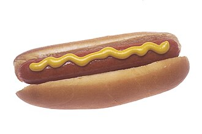
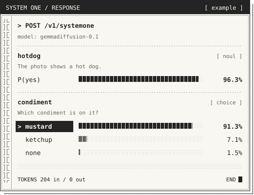

# jevons-rs

A Rust implementation of [TypeSafe AI's System One API](https://docs.typesafe.ai/introduction): typed, probabilistic answers (yes/no, choice, rubric scores) from diffusion language models (DiffusionGemma and NVIDIA Nemotron-Labs-Diffusion, both with image input), running on AMD GPUs through [CubeCL](https://github.com/tracel-ai/cubecl) and [Burn](https://github.com/tracel-ai/burn) with no llama.cpp or C++ build. It includes a Gemma 4 vision encoder, exact prompt-prefix caching and per-GPU autotuning.

jevons-rs serves the System One API. You send a state and questions, and get probability distributions over yes/no answers, choices or rubric scores. Behind it, DiffusionGemma reads fixed answer slots on a masked canvas in a single pass.

Everything is Rust. GPU kernels are written in CubeCL and run on AMD RDNA3 GPUs through HIP, reading the same quantized GGUF weights as llama.cpp. The [CubeCL runtime](docs/cubecl.md) includes a port of the Gemma 4 vision encoder for image questions, bit-exact reuse of cached prompt prefixes, and launch plans tuned to each device at startup.

On a Radeon 8060S (ROCm 7.2.1 under WSL2), it matched the earlier llama.cpp implementation's accuracy on JevBench (190/231 public cases) and on a System One test corpus, at about half the latency. These figures come from that one machine; see [benchmarks](#benchmarks).

> [!IMPORTANT]
> **Hardware:** an AMD RDNA3-class GPU (32-lane waves with WMMA, such as the Radeon 8060S / `gfx1151`) with about 20 GB of free GPU memory, plus ROCm/HIP. NVIDIA (CUDA) GPUs and CPU inference are not supported. Image questions also need a compatible vision projector.

## Credits

This independent learning project builds on several contributions. [TypeSafe AI introduced System One models and Jev](https://typesafe.ai/blog/introducing-system-one-models-and-jev), including the state-and-questions interface and typed probabilistic answers that this API follows.

The DiffusionGemma answer-slot canvas approach used here is inspired by [OpenJev](https://github.com/razorback16/openjev#how-it-works), hosted by [Codiv](https://codiv.ai/): fix the answer template, leave unknown answer slots, and read their probability distributions in one pass. OpenJev credits its structured inference implementation to Matt Mastracci (`mmastrac`)'s [vLLM PR #57250](https://github.com/vllm-project/vllm/pull/57250) and the accompanying `structured_server.py` example.

Credit also goes to Google DeepMind for [DiffusionGemma](https://ai.google.dev/gemma/docs/diffusiongemma/model_card), and to Daniel Han (`danielhanchen`) and the llama.cpp contributors for the native DiffusionGemma support in [PR #24423](https://github.com/ggml-org/llama.cpp/pull/24423). This project first ran on that work, pinned at commit [`12e0a9627d02`](https://github.com/ggml-org/llama.cpp/commit/12e0a9627d02c6395fd4bbf2aadff93d0d46a0e4), and its CubeCL runtime was validated against it: tokenizer, prompt framing, vision preprocessing, image prefill and the diffusion sampler follow that implementation. The llama.cpp backend has since been removed; no C/C++ toolchain or submodule is needed.

## The masked canvas

A canvas is a block of token positions. For this API, we fix the question labels and leave one answer position per question:

```text
Prompt: state + questions + answer codes (A = yes, B = no, ...)

Canvas: Question 1       Question 2
        Answer: [ ? ]   Answer: [ ? ]
                 ^               ^
             answer slot     answer slot
```

The brackets mark unknown answers. We fill those positions with seeded random vocabulary tokens, excluding the special mask token. After caching the prompt, we evaluate the whole canvas once. Bidirectional attention lets each slot use the surrounding canvas and prompt context. We read the logits at each slot and normalize them over its allowed answer codes.

DiffusionGemma's full text generator refines a noisy canvas over multiple denoising steps. By default, this service includes an empty, closed thought channel in the prompt, takes one read with fixed surrounding text, and returns the answer distributions. It generates no thought tokens. Optional extensions add denoising steps, noise samples, a bounded thought, sequential question chunks, and images. See [diffusion and canvas inference](docs/inference.md) for the model explanation, a worked example, and the limits of these probabilities.

## Run

You need Rust 1.95+, ROCm/HIP, an AMD RDNA3-class GPU with about 20 GB of free GPU memory, and a DiffusionGemma GGUF model. Obtain the model yourself. Configure ROCm/HIP with the [build guide](docs/build.md#rocmhip).

```bash
export DIFFUSION_MODEL="$HOME/models/diffusiongemma/diffusiongemma-26B-A4B-it-Q4_K_M.gguf"
cargo run --release --locked -p jevons-rs -- --bind 127.0.0.1:8080
```

The first start on a new GPU measures launch plans and compiles kernel variants, which took a few minutes on the test machine. Later starts reuse the results from `~/.cache/diffusion-cubecl` and load the weights in about 35 s. NVIDIA GPUs and CPU inference are not supported.

### Nemotron-Labs-Diffusion

Point `-m` at a [Nemotron-Labs-Diffusion](https://huggingface.co/nvidia/Nemotron-Labs-Diffusion-VLM-8B) checkpoint directory (BF16 safetensors, about 18 GB); the architecture is detected from its `config.json`, or set it with `--arch nemotron-diffusion`:

```bash
cargo run --release --locked -p jevons-rs -- -m "$HOME/models/nemotron-labs-diffusion-vlm-8b"
```

It runs on the Burn runtime and serves `nemotron-diffusion-8b` (alias `nemotron-diffusion-latest`). The first start compiles and autotunes kernels for several minutes; results are cached in `~/.cache/jevons-burn`. Image questions work without extra files: the checkpoint contains its Pixtral vision tower (no `--mmproj`). Check the model's license (the VLM card names the NVIDIA Source Code License) before any use beyond evaluation.

## Text example

With the service running, in another terminal:

```bash
curl http://127.0.0.1:8080/v1/systemone \
  -H "Content-Type: application/json" \
  --data-binary @examples/system-one.json
```

The example asks three questions about a construction material. Set `TYPESAFE_API_KEY` on the server to enable bearer authentication, then add `-H "Authorization: Bearer $TYPESAFE_API_KEY"` to client calls. The default listener is `127.0.0.1:8080`.

## Image example

For images, start the service with a compatible projector (see [image setup](docs/build.md#image-input)):

```bash
export DIFFUSION_MMPROJ="$HOME/models/diffusiongemma/mmproj-diffusiongemma-26b-a4b-f16.gguf"
cargo run --release --locked -p jevons-rs -- -m "$DIFFUSION_MODEL" --mmproj "$DIFFUSION_MMPROJ"
```

Ask what’s in a photo and get structured answers:

<table>
  <tr>
    <td width="40%" align="center" valign="middle">
      
      <br><sub><strong>INPUT</strong> · Answer about the photo.</sub>
    </td>
    <td width="60%" align="center" valign="middle">
      
    </td>
  </tr>
</table>

Probabilities are rounded from the example response below; model answers can vary.

```bash
curl http://127.0.0.1:8080/v1/systemone \
  -H "Content-Type: application/json" \
  --data-binary @examples/hotdog.json
```

<details>
<summary>View the request</summary>

The image data is abbreviated here; [hotdog.json](examples/hotdog.json) contains the complete request.

```json
{
  "model": "gemmadiffusion-latest",
  "state": "Answer about the photo.",
  "images": [
    "data:image/jpeg;base64,/9j/4gJASU..."
  ],
  "questions": {
    "hotdog": {
      "type": "noul",
      "instructions": "The photo shows a hot dog."
    },
    "condiment": {
      "type": "choice",
      "instructions": "Which condiment is on it?",
      "criteria": {
        "mustard": null,
        "ketchup": null,
        "none": null
      }
    }
  }
}
```

</details>

<details>
<summary>View the full JSON response</summary>

```json
{
  "model": "gemmadiffusion-0.1",
  "answers": {
    "condiment": {
      "type": "choice",
      "choice": "mustard",
      "probabilities": {
        "ketchup": 0.07114288211805858,
        "mustard": 0.9134373998609046,
        "none": 0.01541971802103676
      },
      "confidence": 0.6950052214787418
    },
    "hotdog": {
      "type": "noul",
      "noul": 0.9629650092899195
    }
  },
  "usage": {
    "input_tokens": 204,
    "output_tokens": 0
  }
}
```

</details>


Try the [hot dog photo example](docs/api.md#hot-dog-photo), including the [bundled JPEG](examples/hotdog.jpg), [ready-to-send request](examples/hotdog.json), and startup instructions for the vision projector.

Use [JavaScript SDK examples](examples/javascript/README.md) for application code. The [API reference](docs/api.md) covers request types, model aliases, and errors. Use the [extensions](docs/api.md#extensions) for `steps`, `samples`, `think`, `sequential`, and `images`. Text defaults are `steps=1`, `samples=1`, and `think=0`, with an 8,192-token context. Override the context with `--context-size`; larger contexts allocate more cache memory. Image requests require `--mmproj` or `DIFFUSION_MMPROJ`.

## Benchmarks

Local results use an AMD Ryzen AI MAX+ 395 / Radeon 8060S (ROCm 7.2.1, WSL2), a release build, and the default request settings: `steps=1`, `samples=1`, `think=0`, seed 42, and an 8,192-token context.

### Both models (2026-09-24)

Measured back to back on the current stack (CubeCL 0.11 / Burn 0.22), one model process at a time. See the [two-model report](benchmarks/two-models-2026-09-24/README.md) for per-case files and notes.

| Benchmark | DiffusionGemma Q4_K_M | Nemotron-Labs-Diffusion 8B |
| --- | ---: | ---: |
| JevBench public cases, correct | **189/231 (81.8%)** | 146/231 (63.2%) |
| JevBench p50 / p95 latency | **0.400 / 3.696 s** | 0.644 / 7.934 s |
| System One corpus, questions correct | **75/84 (89.3%)** | 68/84 (81.0%) |
| System One p50 / p95 latency | **365.4 / 1,440.1 ms** | 572.9 / 1,990.2 ms |
| Snake prompt prefill p50 (~470 tokens) | **688 ms** | 1,030 ms |
| Snake canvas forward p50 | **57 ms** | 239 ms |

Against the CubeCL 0.10 build of 2026-09-23 (the table below), DiffusionGemma's JevBench and corpus scores each moved by one near-tie case, while JevBench latency and calibration improved. In an interleaved A/B on one day, the new build prefilled 15–25% faster than the old one. The corpus p95 includes two requests that paid one-time kernel compilation on a freshly started service. Nemotron activates all 8B parameters per forward, while DiffusionGemma's MoE activates about 4B; Nemotron's lower accuracy matches the official Python implementation's answers.

### DiffusionGemma: CubeCL and the former llama.cpp backend (2026-09-23)

| Benchmark | llama.cpp HIP | CubeCL |
| --- | ---: | ---: |
| JevBench public cases, correct | 189/231 (81.8%) | **190/231 (82.3%)** |
| JevBench p50 / p95 latency | 0.912 / 8.124 s | **0.424 / 4.401 s** |
| System One corpus, questions correct | 75/84 (89.3%) | **76/84 (90.5%)** |
| System One p50 / p95 latency | 956.7 / 2,065.8 ms | **338.2 / 862.3 ms** |
| Snake prompt prefill, p50 (466 tokens) | 1,121 ms | **601 ms** |
| Snake canvas forward, p50 | 113 ms | **80 ms** |
| Seven image requests, same answer labels | reference | **7/7** (largest probability difference 0.19) |

CubeCL service results are from 2026-09-23 and llama.cpp service results from 2026-09-21. Both used the same runners, settings, and protocol. The Snake and image rows compare the two backends in one build on 2026-09-23, before llama.cpp was removed, with prompt reuse off for Snake. Accuracy differences of one question are within the effect of CubeCL's FP16 activations, since llama.cpp quantizes activations to 8 bits. See the [backend comparison report](benchmarks/cubecl/results-default-2026-09-23/README.md) and the [image comparison](docs/cubecl.md#images).

### JevBench public cases

On 2026-09-24, DiffusionGemma answered **189/231** and Nemotron-Labs-Diffusion **146/231** public cases correctly, both with 231/231 valid responses. On 2026-09-23, the service on CubeCL 0.10 answered **190/231 public JevBench cases correctly (82.3%)**, with **231/231 valid responses**. The median latency was 0.424 s. On 2026-09-21, llama.cpp scored 189/231 (81.8%) with a median of 0.912 s. See the [per-case CubeCL results](benchmarks/jevbench/results-2026-09-23-cubecl.json).

The earlier llama.cpp `think=1024` run scored **189/231 (81.8%)**, with **231/231 valid responses**; it was not rerun on CubeCL. See the [thinking comparison](benchmarks/jevbench/think1024-defaults-2026-09-21.md) and [per-case results](benchmarks/jevbench/results-2026-09-21-defaults-think1024.json).

All local runs sent one HTTP request at a time over loopback, after one excluded warmup, with no retries. Timeouts were 120 seconds for `think=0` and 900 seconds for `think=1024`. The table compares the same 231 public case IDs. Published reference figures come from [Benchmark Heaven's pinned per-case results](https://github.com/fstandhartinger/jevbench/blob/fd51755eb0c0b546ca206d764faf3302feca913e/results/v1.2/jevbench-v1.2-per-task.json); we did not rerun those deployments.

| Model / configuration | Correct | Accuracy | p50 latency | p95 latency |
| --- | ---: | ---: | ---: | ---: |
| Jev 1.13.0 (TypeSafe AI) | 200/231 | 86.6% | 0.665 s | 0.803 s |
| djev (Maisa, diffusion-gemma) | 194/231 | 84.0% | 0.239 s | 0.354 s |
| OpenJev (DiffusionGemma 26B-A4B NVFP4, razorback16) | 189/231 | 81.8% | 0.246 s | 0.459 s |
| SemIf, formerly OpenJev (Qwen3.5-4B, TheoLeeCJ) | 187/231 | 81.0% | 0.194 s | 0.538 s |
| **Local DiffusionGemma Q4_K_M, CubeCL 0.11 (Sep 24)** | **189/231** | **81.8%** | **0.400 s** | **3.696 s** |
| Local DiffusionGemma Q4_K_M, CubeCL 0.10 (Sep 23) | 190/231 | 82.3% | 0.424 s | 4.401 s |
| Local Nemotron-Labs-Diffusion 8B (Sep 24) | 146/231 | 63.2% | 0.644 s | 7.934 s |
| Local Q4_K_M, llama.cpp | 189/231 | 81.8% | 0.912 s | 8.124 s |
| Local Q4_K_M, llama.cpp, `think=1024` | 189/231 | 81.8% | 18.325 s | 37.483 s |

p50 is the median and p95 the 95th percentile, using linear interpolation over caller wall times for all attempts. Local timings include HTTP and inference but exclude model loading and the warmup. Published timings use millisecond-rounded data from deployments measured from Germany. Hardware, network paths, quantization, and inference settings differ, so this table does not isolate model speed.

These 231 public cases omit 303 decisions from the full benchmark. They do not establish an official leaderboard score or unseen-task accuracy. See the [benchmark report and reproduction commands](benchmarks/jevbench/README.md) and [per-case results and provenance](benchmarks/jevbench/results-2026-09-21-defaults.json). The [earlier baseline and thinking runs](benchmarks/jevbench/baseline-2026-09-21.md) used a 4,096-token context and remain available for historical comparison.

### System One comparison corpus

On 2026-09-23, the service on CubeCL scored **76/84 (90.5%)**, with **72/72 valid responses** and a 338.2 ms median latency. Each run used the same 72 requests and 84 questions, one round, concurrency one, and no benchmark warmups or retries. Hosted TypeSafe was last measured on September 19.

| Metric | Gemma CubeCL 0.11, Sep 24 | Nemotron, Sep 24 | Gemma CubeCL 0.10, Sep 23 | Local llama.cpp, Sep 21 | Local llama.cpp, Sep 19 | Hosted `jev-1.13.0`, Sep 19 |
| --- | --- | --- | --- | --- | --- | --- |
| Question accuracy | 75/84 (89.3%) | 68/84 (81.0%) | **76/84 (90.5%)** | 75/84 (89.3%) | 65/84 (77.4%) | 80/84 (95.2%) |
| Valid responses | 72/72 | 72/72 | 72/72 | 72/72 | 72/72 | 71/72 |
| p50 latency, valid responses | 365.4 ms | 572.9 ms | **338.2 ms** | 956.7 ms | 588.4 ms | 339.9 ms |
| p95 latency, valid responses | 1,440.1 ms | 1,990.2 ms | **862.3 ms** | 2,065.8 ms | 1,314.6 ms | 881.0 ms |
| Mean latency, all attempts | 648.4 ms | 812.3 ms | **484.4 ms** | 1,112.6 ms | 683.6 ms | 838.4 ms |

The September 24 runs each started from a freshly started service; DiffusionGemma's p95 and mean include two requests (7.7 s and 6.9 s) that paid one-time kernel compilation, and its one lost question (`relational-join_missing`) was a near-tie already at 0.48 on September 23. Local p50 latency matches hosted TypeSafe's September 19 figure, though hardware and network paths differ. The CubeCL mean includes one 7.3 s request that paid a one-time kernel compilation; see the [CubeCL corpus run](benchmarks/system-one/README.md#recorded-cubecl-results-2026-09-23). Between September 19 and 21, the llama.cpp score improved by 10 questions (11.9 percentage points). These are exploratory measurements on a small synthetic corpus. The September 21 run used a newly started service without inference warmups; another local service remained loaded and machine activity was not controlled. September 19 lacks hardware and quantization provenance, so the timings do not isolate the effect of the inference changes. The historical hosted timeout counts as incorrect and contributes to its all-attempt mean. See [results and methodology](benchmarks/system-one/README.md) and the per-request snapshots for [CubeCL](benchmarks/system-one/results-2026-09-23-cubecl.json) and [llama.cpp](benchmarks/system-one/results-2026-09-21-defaults.json).

## Documentation

| Guide | Contents |
| --- | --- |
| [Build and hardware](docs/build.md) | ROCm/WSL setup, hardware, runtime options, image input |
| [CubeCL runtime](docs/cubecl.md) | Status, device tuning, image encoder, design, tests |
| [Diffusion and canvas inference](docs/inference.md) | Denoising, answer slots, probability math |
| [HTTP API](docs/api.md) | Question types, authentication, limits, errors |
| [Development](docs/development.md) | Crate layout, tests, recipes, SCM CLI |
| [JevBench](benchmarks/jevbench/README.md) | Public benchmark results, published comparisons, reproduction commands |
| [System One comparison](benchmarks/system-one/README.md) | Synthetic corpus, local/hosted results, scoring, runner settings |
