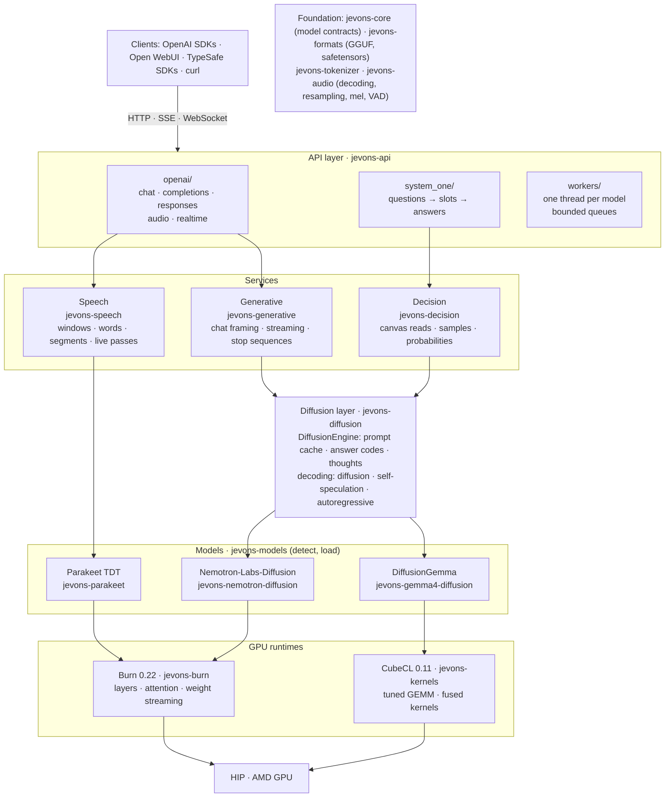

# jevons-rs

A personal inference runtime in Rust. jevons-rs runs language and speech models on your own AMD GPU with [Burn](https://github.com/tracel-ai/burn) and [CubeCL](https://github.com/tracel-ai/cubecl), and serves them as three services behind APIs that existing tools already speak:

- **Generative:** free-form chat and text from diffusion language models, through the OpenAI-compatible Chat Completions, Completions and Responses APIs (streaming included), for OpenAI SDKs, Open WebUI and other clients.
- **Speech:** speech to text, through the OpenAI-compatible transcriptions API for uploads (subtitles and word timestamps included) and Realtime transcription over a WebSocket for live dictation.
- **Decision:** typed, probabilistic answers (yes/no, choice, rubric scores) about a state and a set of questions, read from a diffusion model's masked canvas in one pass, through the [System One](https://docs.typesafe.ai/introduction) API.

Everything is Rust: model code, GPU kernels (written in CubeCL and compiled at runtime for the device), audio decoding and the HTTP server. There is no Python, llama.cpp or C/C++ build. Each model runs on its own worker thread with a bounded queue, so a transcription never waits behind a long generation.

> [!IMPORTANT]
> **Hardware:** an AMD RDNA3-class GPU (32-lane waves with WMMA, such as the Radeon 8060S / `gfx1151`) and ROCm/HIP; NVIDIA (CUDA) GPUs and CPU inference are not supported yet. GPU memory needed depends on the models you load: about 20 GB for DiffusionGemma, 18 GB for Nemotron-Labs-Diffusion 8B, 7 GB for its 3B, and 1.2 GB for Parakeet. All figures here come from one machine, a Radeon 8060S (ROCm 7.2.1 under WSL2).

## Architecture



- **API layer** (`jevons-api`): routes, authentication, settings and the wire formats. OpenAI requests become Generative or Speech calls, and System One questions compile into Decision reads. Each loaded model gets one worker thread: the diffusion worker serves both Generative and Decision jobs on one engine, and the speech worker runs live Realtime passes ahead of queued uploads. The `jevons-rs` binary is a thin wrapper around it.
- **Services** take typed Rust requests and return typed results, with no HTTP, JSON or async code:
  - **Generative** (`jevons-generative`) frames conversations, reserves an optional thought, and streams the answer while holding back text that could still become a stop sequence.
  - **Decision** (`jevons-decision`) reads every answer slot's distribution over its candidates from one canvas forward, averages samples and chunks slots that exceed one canvas. It also has the `jevons-scm` CLI.
  - **Speech** (`jevons-speech`) windows recordings longer than one model pass into words and segments, and runs single passes for live utterances.
- **Diffusion layer** (`jevons-diffusion`): the part Generative and Decision share. `DiffusionEngine` owns a loaded diffusion model with its chat framing, verified answer codes and context limits, and generates bounded token runs (thoughts and answers) with masked or uniform-noise diffusion, self-speculation or autoregressive decoding.
- **Models** implement the contracts in `jevons-core` (`DiffusionModel`, `SpeechModel`), and `jevons-models` detects which one a model file holds. DiffusionGemma runs on hand-tuned CubeCL kernels, while Nemotron-Labs-Diffusion and Parakeet run on Burn, all on the same CubeCL runtime and HIP device.

## Models

| Model | Kind | Runtime | Services |
| --- | --- | --- | --- |
| [DiffusionGemma 26B-A4B](https://ai.google.dev/gemma/docs/diffusiongemma/model_card) (GGUF, Q4_K_M; image input with its vision projector) | Diffusion language model (MoE) | CubeCL kernels | Generative, Decision |
| [Nemotron-Labs-Diffusion](https://huggingface.co/nvidia/Nemotron-Labs-Diffusion-VLM-8B) 8B VLM or [3B](https://huggingface.co/nvidia/Nemotron-Labs-Diffusion-3B) (safetensors) | Diffusion language model, with self-speculative autoregressive decoding | Burn | Generative, Decision |
| [Parakeet TDT 0.6B v3](https://huggingface.co/nvidia/parakeet-tdt-0.6b-v3) (safetensors) | Speech recognition, 25 European languages including Spanish and English | Burn | Speech |

A settings file declares each model once and points services at it: Generative and Decision usually share one loaded diffusion model (one engine and queue, the masked canvas used or not per request), and can also use two different ones. The architecture is detected from the model files. Obtain the models yourself and check their licenses.

## Quick start

You need Rust 1.95+, ROCm/HIP ([build guide](docs/build.md#rocmhip)) and at least one model. Describe the models and the services that use them in `jevons.toml`:

```toml
[server]
bind = "127.0.0.1:8080"

[models.nemotron]                  # loaded once
path = "~/models/nemotron-labs-diffusion-3b"
decoding = "self-speculation"

[models.parakeet]
path = "~/models/parakeet-tdt-0.6b-v3"

[services.generative]              # OpenAI chat, completions, responses
model = "nemotron"
[services.decision]                # System One, on the same engine
model = "nemotron"
[services.speech]                  # transcriptions and Realtime
model = "parakeet"
```

```bash
cargo run --release --locked -p jevons-rs -- --config jevons.toml
```

Without `--config`, the server reads `./jevons.toml` or `~/.config/jevons/config.toml`. [jevons.example.toml](jevons.example.toml) lists every key: per model the served `id`, context and batch sizes, decoding, seed, prompt cache and queue capacity; per service its model, and for speech the audio limit and Realtime switch. `--bind` overrides the address; set `TYPESAFE_API_KEY` to require a bearer key on `/v1/*`.

The first start on a new GPU compiles and tunes kernels for a few minutes; later starts reuse the caches in `~/.cache/diffusion-cubecl` (DiffusionGemma) and `~/.cache/jevons-burn` (Burn models). Every loaded model is listed by `GET /v1/models`, under its ID and aliases: the language model also answers to `jev-latest`, and Parakeet to `parakeet-latest`, which the examples below use.

## API examples

Run these from the repository root against the server above. [examples/openai-sdk.py](examples/openai-sdk.py) runs the OpenAI-compatible ones through the official Python SDK (`uv run examples/openai-sdk.py`).

### Generative: Chat Completions

```bash
curl http://127.0.0.1:8080/v1/chat/completions -H "Content-Type: application/json" \
  --data-binary @examples/chat-completions.json
```

```python
from openai import OpenAI

client = OpenAI(base_url="http://127.0.0.1:8080/v1", api_key="unused-without-a-key")
reply = client.chat.completions.create(
    model="jev-latest",
    messages=[{"role": "user", "content": "What is 15% of 240?"}],
)
print(reply.choices[0].message.content)
```

Add `"stream": true` for server-sent events. `reasoning_effort` lets the model think before it answers. Decoding is greedy; tools, several choices and log probabilities are rejected with `400`.

### Generative: Responses and Completions

```bash
curl http://127.0.0.1:8080/v1/responses -H "Content-Type: application/json" \
  --data-binary @examples/responses.json
curl http://127.0.0.1:8080/v1/completions -H "Content-Type: application/json" \
  --data-binary @examples/completions.json
```

Responses takes `instructions`, text `input` or messages, and `reasoning.effort`; nothing is stored. Completions continues raw text without chat markers. See [OpenAI-compatible generation](docs/api.md#openai-compatible-generation).

### Speech: transcriptions

```bash
curl http://127.0.0.1:8080/v1/audio/transcriptions \
  -F file=@examples/speech-es.flac -F model=parakeet-latest -F language=es
curl http://127.0.0.1:8080/v1/audio/transcriptions \
  -F file=@examples/speech-en.flac -F model=parakeet-latest -F response_format=srt
```

```python
with open("examples/speech-es-browser.webm", "rb") as audio:
    text = client.audio.transcriptions.create(model="parakeet-latest", file=audio).text
```

The server accepts WAV, FLAC, MP3, OGG Vorbis or Opus, WebM/Opus (what browsers record) and M4A. Responses come as `json`, `text`, `srt`, `vtt` or `verbose_json` with segment and word timestamps, optionally streamed. Recordings longer than two minutes are transcribed in overlapping windows. See [speech to text](docs/api.md#speech-to-text).

### Speech: Realtime transcription

```bash
uv run examples/realtime.py examples/speech-es.flac --url ws://127.0.0.1:8080/v1/realtime --language es
```

`GET /v1/realtime` speaks the OpenAI Realtime protocol for transcription sessions (the GA events and the beta `transcription_session.*` ones). Clients stream PCM16 (or G.711) audio. A server-side turn detector commits each turn at a pause, or the client commits it. Words agreed by consecutive passes arrive as deltas while the user speaks, and the final transcript follows each turn. The example script streams a file at real-time pace; the OpenAI SDK's `client.realtime.connect(...)` works too.

### Decision: System One

```bash
curl http://127.0.0.1:8080/v1/systemone -H "Content-Type: application/json" \
  --data-binary @examples/system-one.json
```

With Nemotron-Labs-Diffusion 3B, abbreviated:

```json
{"model": "nemotron-diffusion-3b",
 "answers": {
   "is_scm": {"type": "noul", "noul": 0.930},
   "material_family": {"type": "choice", "choice": "scm", "confidence": 0.985,
                       "probabilities": {"scm": 0.998, "aggregate": 0.002, "reinforcement": 0.0004}},
   "cement_replacement": {"type": "score", "score": 1.93, "confidence": 0.779,
                          "probabilities": {"0": 0.021, "1": 0.031, "2": 0.947}}},
 "usage": {"input_tokens": 210, "output_tokens": 0}}
```

The [example](examples/system-one.json) asks three question types about a construction material; [hotdog.json](examples/hotdog.json) asks about a photo. The [System One guide](docs/system-one.md) explains the masked canvas, extensions (`steps`, `samples`, `think`, `sequential`, `images`) and the image example. [JavaScript SDK examples](examples/javascript/README.md) show application code.

## Clients

- **OpenAI SDKs** (Python, JavaScript and others): set `base_url` to `http://127.0.0.1:8080/v1`. Chat, Responses, Completions, transcriptions and Realtime transcription sessions all parse into the SDKs' own types.
- **Open WebUI:** add an OpenAI connection with the base URL above for chat. For dictation and voice calls, set Admin Panel → Settings → Audio → Speech-to-Text to the *OpenAI* engine with the same URL and model `parakeet-tdt-0.6b-v3`, and use *Web API* for text to speech. The model selector picks the chat model; dictation always uses the Audio setting.
- **TypeSafe SDKs:** set `TYPESAFE_BASE_URL=http://127.0.0.1:8080` and use `jev-latest`. No connection to TypeSafe or Codiv infrastructure is needed.

## Performance

On the Radeon 8060S, measured when warm:

| Workload | Result |
| --- | --- |
| Decision (System One), DiffusionGemma Q4_K_M | JevBench public cases 189/231 correct, 0.40 s median |
| Decision (System One), Nemotron-Labs-Diffusion 3B | 143/231, 0.27 s median |
| Generative and Decision thoughts, Nemotron-Labs-Diffusion 8B, `decoding = "self-speculation"` | 11.1 tokens/s (5.7 with diffusion) |
| Speech, Parakeet TDT v3 | 16 s of Spanish in 0.55 s; a 186 s MP3 in 5.7 s |

See [benchmarks](benchmarks/README.md) for methods, per-case results and comparisons with hosted System One services.

## Documentation

| Guide | Contents |
| --- | --- |
| [HTTP API](docs/api.md) | Routes, settings, OpenAI-compatible generation, speech to text, Realtime, limits, errors |
| [System One](docs/system-one.md) | The masked canvas, text and image examples, extensions |
| [Build and hardware](docs/build.md) | ROCm/WSL setup, hardware, runtime options, image input |
| [Diffusion and canvas inference](docs/inference.md) | Denoising, answer slots, probability math, masked diffusion decoding |
| [CubeCL runtime](docs/cubecl.md) | DiffusionGemma kernels, device tuning, image encoder, tests |
| [Development](docs/development.md) | Layers and crates, checks, GPU parity tests, golden references, recipes |
| [Benchmarks](benchmarks/README.md) | JevBench, the System One corpus, backend comparisons, speech to text |

## Credits

This independent learning project builds on several contributions. [TypeSafe AI introduced System One models and Jev](https://typesafe.ai/blog/introducing-system-one-models-and-jev), including the state-and-questions interface and typed probabilistic answers that this API follows.

The DiffusionGemma answer-slot canvas approach used here is inspired by [OpenJev](https://github.com/razorback16/openjev#how-it-works), hosted by [Codiv](https://codiv.ai/): fix the answer template, leave unknown answer slots, and read their probability distributions in one pass. OpenJev credits its structured inference implementation to Matt Mastracci (`mmastrac`)'s [vLLM PR #57250](https://github.com/vllm-project/vllm/pull/57250) and the accompanying `structured_server.py` example.

Credit also goes to Google DeepMind for [DiffusionGemma](https://ai.google.dev/gemma/docs/diffusiongemma/model_card), and to Daniel Han (`danielhanchen`) and the llama.cpp contributors for the native DiffusionGemma support in [PR #24423](https://github.com/ggml-org/llama.cpp/pull/24423). This project first ran on that work, pinned at commit [`12e0a9627d02`](https://github.com/ggml-org/llama.cpp/commit/12e0a9627d02c6395fd4bbf2aadff93d0d46a0e4), and its CubeCL runtime was validated against it: tokenizer, prompt framing, vision preprocessing, image prefill and the diffusion sampler follow that implementation. The llama.cpp backend has since been removed; no C/C++ toolchain or submodule is needed.

Speech to text runs NVIDIA's [Parakeet TDT 0.6B v3](https://huggingface.co/nvidia/parakeet-tdt-0.6b-v3) (CC BY 4.0), ported from the Hugging Face `ParakeetForTDT` implementation and checked against it. The speech fixtures are a [LibriSpeech](https://www.openslr.org/12) utterance (CC BY 4.0), via `hf-internal-testing/librispeech_asr_dummy`, and the opening of *Cuentos rusos* read for [LibriVox](https://librivox.org/) (public domain).
