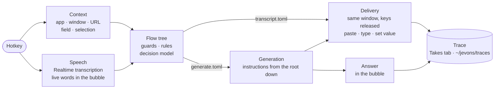
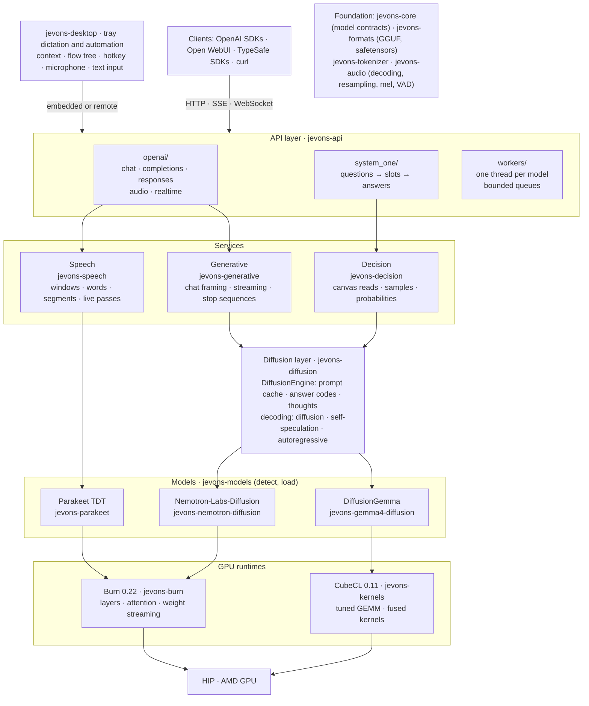

<p align="center"></p>

# jevons-rs

**Context-aware dictation and desktop automation, on models that run on your own GPU.**

jevons is a tray app. Press a hotkey in any application and speak. It reads where you are (the application, the page, the field, the selection), transcribes you, and walks a **flow tree**: a folder of TOML files where every folder is a step, like file-system routing in a web framework. Rules and a decision model pick the branch, and the branch decides what happens: type your words, rewrite the selection, answer a question in a bubble by the tray icon, or call a tool.

Everything runs locally. The speech, decision and language models run inside the app on an AMD GPU, through a Rust inference runtime built on [Burn](https://github.com/tracel-ai/burn) and [CubeCL](https://github.com/tracel-ai/cubecl). That runtime is also a server with OpenAI-compatible and [System One](https://docs.typesafe.ai/introduction) APIs (see [The runtime](#the-runtime)).

> [!IMPORTANT]
> **Hardware:** an AMD RDNA3-class GPU (32-lane waves with WMMA, such as the Radeon 8060S / `gfx1151`) and ROCm/HIP; NVIDIA (CUDA) GPUs and CPU inference are not supported yet. The default models need about 20 GB of GPU memory for DiffusionGemma and 1.2 GB for Parakeet. The desktop app is complete on Windows; Linux has the basics, and macOS has no tray or hotkey yet (see [Platform status](#platform-status)). All figures here come from one machine, a Radeon 8060S (ROCm 7.2.1).

## The desktop app

- **Context-aware.** On Windows, UI Automation gives the focused field's role and name, the selection, the text around the caret and the browser's address. Password fields are never read, text is truncated, and the clipboard is read only if you allow it.
- **A flow tree you can edit.** Each folder holds one node file: `decide.toml` picks a subfolder, `generate.toml` writes with the language model, `transcript.toml` uses the words as heard, and `tool.toml` and `agent.toml` call tools. Guards (`[when]` rules on the application, window, page, field, selection or the words themselves) prune branches with no model call. Instructions add up from the root down. The files reload as soon as you save them, and an `AGENTS.md` in the folder teaches coding agents the format.
- **Reads more of the screen when a branch asks.** An `[extract]` pulls elements out of the application's interface with an XPath expression (a chat's channels, its last messages), with no model and in tens of milliseconds. An `[investigate]` question sends an agent through the interface when the answer's place is not known in advance.
- **Automations you show once.**
  - **Recording:** record a task (click, type, press keys) and say what it is.
  - **Writing:** jevons writes a script that does it again, taking as arguments what should change, such as the channel and the message. It checks the script by replaying your recording step by step.
  - **Approving:** you approve that exact version.
  - **Running:** from then on, run it from the tray, a hotkey, or by saying "post to random that lunch is ready". Scripts act only in their own applications, and each run asks first.
- **Decides only what rules leave open.** Per-application branches choose by priority; the decision model chooses the rest by the branches' descriptions, asking consecutive decisions in one request, so a dictation usually costs one call. Unsure answers fall back to a safe branch.
- **Push-to-talk and live dictation.** Each has its own hotkey, and each either listens while held or toggles with a press. In live dictation the app ends a phrase at each pause and keeps all the audio. When you stop, the whole transcript is edited and inserted once.
- **Live feedback and answers.** A bubble above the tray icon shows the words as they are recognized, then the route taken, the text written and whether it was inserted. Questions are answered there instead of being typed. It never takes the focus. Turn it off from the tray menu.
- **Safe delivery.** Text goes only into the window the take started in, once every key is released. It is pasted with your clipboard restored, typed, set through the accessibility API, or left on the clipboard, as the flow says. If the focus moved, the text waits on the clipboard.
- **An inspector for everything.** The window shows the live context and the route it takes through the tree, with every guard checked; every take with its decision probabilities, prompt and timings; the flow tree and its problems; the settings and the models. **New branch from the current context** writes a folder whose guard matches what you are looking at.
- **Private by default.** The models run in the app, and its API listens on a loopback port with a random key. You can expose it on a port for other clients, or use a jevons server on another machine instead. Logs never contain your text; full traces stay in `~/jevons/traces`.

### From speech to a leaf


```mermaid
flowchart LR
    hotkey(["Hotkey"]) --> context["Context<br/>app · window · URL<br/>field · selection"]
    hotkey --> speech["Speech<br/>Realtime transcription<br/>live words in the bubble"]
    context --> tree["Flow tree<br/>guards · rules<br/>decision model"]
    speech --> tree
    tree -- "generate.toml" --> generate["Generation<br/>instructions from the root down"]
    tree -- "transcript.toml" --> deliver
    generate --> deliver["Delivery<br/>same window, keys released<br/>paste · type · set value"]
    generate --> bubble["Answer<br/>in the bubble"]
    deliver --> trace[("Trace<br/>Takes tab · ~/jevons/traces")]
    bubble --> trace
```

### Getting started

jevons builds from source. On Windows you need:

- [Rust](https://rustup.rs) 1.95 or newer, with the MSVC build tools.
- The AMD HIP SDK ([build guide](docs/build.md#rocmhip)).
- Python 3 from python.org or `winget install Python.Python.3.12`. The Blitz CSS engine generates code with it at build time; the Microsoft Store alias is not enough.
- Smart App Control turned off, because it blocks the unsigned build scripts cargo compiles.

```bash
cargo run --release --locked -p jevons-desktop
```

From WSL, `just desktop-windows` does the same natively on Windows. It mirrors your working tree (uncommitted changes included) into a Windows clone (`%USERPROFILE%\src\jevons-rs`), builds it in release mode, installs it into `%USERPROFILE%\jevons` and starts it; `--no-run` leaves it stopped and `--build` only builds. See [scripts/windows-desktop.sh](scripts/windows-desktop.sh).

The app starts in the tray, with no console window. The [Desktop workflow](.github/workflows/desktop.yml) also builds it for Windows and Linux on every push to `dev` and `main`: download the package from the run's artifacts.

1. **Download the models.** Open the window (**Show context inspector** in the tray menu) and go to **Models**. Press **Download** on DiffusionGemma (about 18 GB, with its vision projector) and Parakeet (2.5 GB). They go to `~/jevons/models`, or to a folder you choose. Nothing downloads by itself, and **Use existing…** points at models already on disk.
2. **Wait for the first load.** The icon is blue while the models load. On the first runs on a machine it turns amber while GPU kernels are tuned, which takes a few minutes and is cached for later runs.
3. **Dictate.** When the icon glows cyan, hold `Ctrl+Alt+Space` in any text field and speak. Hold `F9` for live dictation. **Settings** changes the hotkeys, the hold-or-toggle mode, the microphone and the language. Set the language if you always speak one: the transcript then stays in that language's alphabet.

Settings are in `%APPDATA%\jevons\config\jevons-desktop.toml` (see [jevons-desktop.example.toml](jevons-desktop.example.toml)). The flow tree is in the `flows` folder next to it. Logs and traces are in `~/jevons`, which the tray's **Open logs and traces** opens.

### The flow tree

```
flows/
  decide.toml              # the root: dictate, ask or run? In Slack, reads its messages by XPath
  dictate/
    decide.toml            # select = "rules": the application picks the branch; [prefer] terminals
    chat/decide.toml       # [when] app = ["slack.exe", …]; casual instructions
    code/decide.toml       # only insert or type as heard
    terminal/decide.toml   # prompts and commands: never rewrite the terminal's buffer
    any/decide.toml        # everything else
  ask/                     # [prefer] transcript: words starting with "Pregunta" or "Question"
    slack/generate.toml    # output = "bubble"; answers from the root's Slack extracts
    chat/generate.toml     # other chat apps: reads the open conversation first
    any/generate.toml
  run/run.toml             # runs an approved automation
  _actions/                # shared: insert, replace, rewrite, verbatim
```

A branch is a folder with one file:

```toml
# flows/dictate/chat/decide.toml
description = "A chat application"
priority = 20
branches = "_actions"      # take insert, replace, rewrite and verbatim from the shared folder
instructions = "Casual and concise. Keep emoji and names exactly as dictated. No sign-off."

[when]
app = ["slack.exe", "*teams*", "discord*"]
```

jevons writes the built-in tree ([examples/desktop/flows](examples/desktop/flows)) on the first run, with an `AGENTS.md` that documents the format for people and coding agents. `jevons-desktop --check-flows` checks a folder and `--transcript "…"` runs a take from text, so a change can be tried without speaking. A hotkey or the tray's **Start takes at** menu can start a take below the root, such as at `ask`.

### The tray icon


From left to right: ready (cyan), models loading (blue), kernels tuning (amber), no models (grey), a failed take (red), listening (the waveform follows your voice), transcribing and writing.

### Platform status

| Layer | Windows | Linux | macOS |
| --- | --- | --- | --- |
| Context | UI Automation: role, name, selection, caret text, browser address | active window only | active window only |
| Text input | paste, type (SendInput) or set value (UI Automation) | clipboard | clipboard |
| Microphone | CPAL (WASAPI) | CPAL (ALSA/PulseAudio) | CPAL (CoreAudio) |
| Hotkey, tray | global-hotkey, tray-icon | global-hotkey (X11), tray-icon (AppIndicator) | not yet |

Every platform layer is a trait in `jevons-desktop-core`, with the pipeline, the flow tree and tray states shared across platforms. The [desktop guide](docs/desktop.md) covers the flow tree, the inspector, settings, models, headless runs and the app's threads.

## The runtime

The app's models run on a Rust inference runtime, which is also a server for other tools. It offers three services behind APIs that existing clients already speak:

- **Generative:** free-form chat and text from diffusion language models, through the OpenAI-compatible Chat Completions, Completions and Responses APIs (streaming, function tools and JSON Schema output included), for OpenAI SDKs, agent frameworks, Open WebUI and other clients.
- **Speech:** speech to text, through the OpenAI-compatible transcriptions API for uploads (subtitles and word timestamps included) and Realtime transcription over a WebSocket for live dictation.
- **Decision:** typed, probabilistic answers (yes/no, choice, rubric scores) about a state and a set of questions, read from a diffusion model's masked canvas in one pass, through the [System One](https://docs.typesafe.ai/introduction) API.

Everything is Rust: model code, GPU kernels (written in CubeCL and compiled at runtime for the device), audio decoding and the HTTP server. There is no Python, llama.cpp or C/C++ build. Each model runs on its own worker thread with a bounded queue, so a transcription never waits behind a long generation.

### Architecture


```mermaid
flowchart TB
    clients["Clients: OpenAI SDKs · Open WebUI · TypeSafe SDKs · curl"]
    desktop["jevons-desktop · tray dictation and automation<br/>context · flow tree · hotkey · microphone · text input"]

    subgraph api["API layer · jevons-api"]
        direction LR
        openai["openai/<br/>chat · completions · responses<br/>audio · realtime"]
        systemone["system_one/<br/>questions → slots → answers"]
        workers["workers/<br/>one thread per model<br/>bounded queues"]
    end

    subgraph services["Services"]
        direction LR
        generative["Generative<br/>jevons-generative<br/>chat framing · streaming · stop sequences"]
        decision["Decision<br/>jevons-decision<br/>canvas reads · samples · probabilities"]
        speech["Speech<br/>jevons-speech<br/>windows · words · segments · live passes"]
    end

    diffusion["Diffusion layer · jevons-diffusion<br/>DiffusionEngine: prompt cache · answer codes · thoughts<br/>decoding: diffusion · self-speculation · autoregressive"]

    subgraph models["Models · jevons-models (detect, load)"]
        direction LR
        gemma["DiffusionGemma<br/>jevons-gemma4-diffusion"]
        nemotron["Nemotron-Labs-Diffusion<br/>jevons-nemotron-diffusion"]
        parakeet["Parakeet TDT<br/>jevons-parakeet"]
    end

    subgraph runtimes["GPU runtimes"]
        direction LR
        cubecl["CubeCL 0.11 · jevons-kernels<br/>tuned GEMM · fused kernels"]
        burn["Burn 0.22 · jevons-burn<br/>layers · attention · weight streaming"]
    end

    gpu["HIP · AMD GPU"]
    foundation["Foundation: jevons-core (model contracts) · jevons-formats (GGUF, safetensors)<br/>jevons-tokenizer · jevons-audio (decoding, resampling, mel, VAD)"]

    clients -- "HTTP · SSE · WebSocket" --> api
    desktop -- "embedded or remote" --> api
    openai --> generative
    openai --> speech
    systemone --> decision
    generative --> diffusion
    decision --> diffusion
    diffusion --> gemma
    diffusion --> nemotron
    speech --> parakeet
    gemma --> cubecl
    nemotron --> burn
    parakeet --> burn
    cubecl --> gpu
    burn --> gpu
```

- **Desktop** (`jevons-desktop`, over the platform-free `jevons-desktop-core`): the desktop agent. Each platform layer (accessibility context, microphone, text input, hotkey, tray) is a trait with a per-OS implementation; the pipeline, the flow tree and tray states are shared. It loads the API layer in-process, optionally exposing it on a port.
- **API layer** (`jevons-api`): routes, authentication, settings and the wire formats. OpenAI requests become Generative or Speech calls, and System One questions compile into Decision reads. Each loaded model gets one worker thread: the diffusion worker serves both Generative and Decision jobs on one engine, and the speech worker runs live Realtime passes ahead of queued uploads. The `jevons-rs` binary is a thin wrapper around it.
- **Services** take typed Rust requests and return typed results, with no HTTP, JSON or async code:
  - **Generative** (`jevons-generative`) frames conversations, reserves an optional thought, and streams the answer while holding back text that could still become a stop sequence.
  - **Decision** (`jevons-decision`) reads every answer slot's distribution over its candidates from one canvas forward, averages samples and chunks slots that exceed one canvas. It also has the `jevons-scm` CLI.
  - **Speech** (`jevons-speech`) windows recordings longer than one model pass into words and segments, and runs single passes for live utterances.
- **Diffusion layer** (`jevons-diffusion`): the part Generative and Decision share. `DiffusionEngine` owns a loaded diffusion model with its chat framing, verified answer codes and context limits, and generates bounded token runs (thoughts and answers) with masked or uniform-noise diffusion, self-speculation or autoregressive decoding.
- **Models** implement the contracts in `jevons-core` (`DiffusionModel`, `SpeechModel`), and `jevons-models` detects which one a model file holds. DiffusionGemma runs on hand-tuned CubeCL kernels, while Nemotron-Labs-Diffusion and Parakeet run on Burn, all on the same CubeCL runtime and HIP device.

### Models

| Model | Kind | Runtime | Services |
| --- | --- | --- | --- |
| [DiffusionGemma 26B-A4B](https://ai.google.dev/gemma/docs/diffusiongemma/model_card) (GGUF, Q4_K_M; image input with its vision projector) | Diffusion language model (MoE) | CubeCL kernels | Generative, Decision |
| [Nemotron-Labs-Diffusion](https://huggingface.co/nvidia/Nemotron-Labs-Diffusion-VLM-8B) 8B VLM or [3B](https://huggingface.co/nvidia/Nemotron-Labs-Diffusion-3B) (safetensors) | Diffusion language model, with self-speculative autoregressive decoding | Burn | Generative, Decision |
| [Parakeet TDT 0.6B v3](https://huggingface.co/nvidia/parakeet-tdt-0.6b-v3) (safetensors) | Speech recognition, 25 European languages including Spanish and English | Burn | Speech |

A settings file declares each model once and points services at it: Generative and Decision usually share one loaded diffusion model (one engine and queue, the masked canvas used or not per request), and can also use two different ones. The architecture is detected from the model files. Obtain the models yourself and check their licenses.

### Running the server

The desktop app embeds the runtime, so this is only needed to serve other clients or a remote desktop app. You need Rust 1.95+, ROCm/HIP ([build guide](docs/build.md#rocmhip)) and at least one model. Describe the models and the services that use them in `jevons.toml`:

```toml
[server]
bind = "127.0.0.1:8080"

[models.nemotron]                  # loaded once
path = "~/models/nemotron-labs-diffusion-3b"
decoding = "self-speculation"

[models.parakeet]
path = "~/models/parakeet-tdt-0.6b-v3"

[services.generative]              # OpenAI chat, completions, responses
model = "nemotron"
[services.decision]                # System One, on the same engine
model = "nemotron"
[services.speech]                  # transcriptions and Realtime
model = "parakeet"
```

```bash
cargo run --release --locked -p jevons-rs -- --config jevons.toml
```

Without `--config`, the server reads `./jevons.toml` or `~/.config/jevons/config.toml`. [jevons.example.toml](jevons.example.toml) lists every key: per model the served `id`, context and batch sizes, decoding, seed, prompt cache and queue capacity; per service its model, and for speech the audio limit and Realtime switch. `--bind` overrides the address; set `TYPESAFE_API_KEY` to require a bearer key on `/v1/*`.

The first start on a new GPU compiles and tunes kernels for a few minutes; later starts reuse the caches in `~/.cache/diffusion-cubecl` (DiffusionGemma) and `~/.cache/jevons-burn` (Burn models). Every loaded model is listed by `GET /v1/models`, under its ID and aliases: the language model also answers to `jev-latest`, and Parakeet to `parakeet-latest`, which the examples below use.

### API examples

Run these from the repository root against the server above. [examples/openai-sdk.py](examples/openai-sdk.py) runs the OpenAI-compatible ones through the official Python SDK (`uv run examples/openai-sdk.py`).

#### Generative: Chat Completions

```bash
curl http://127.0.0.1:8080/v1/chat/completions -H "Content-Type: application/json" \
  --data-binary @examples/chat-completions.json
```

```python
from openai import OpenAI

client = OpenAI(base_url="http://127.0.0.1:8080/v1", api_key="unused-without-a-key")
reply = client.chat.completions.create(
    model="jev-latest",
    messages=[{"role": "user", "content": "What is 15% of 240?"}],
)
print(reply.choices[0].message.content)
```

Add `"stream": true` for server-sent events. `reasoning_effort` lets the model think before it answers. Function `tools` and `json_schema` output work too: the next step and labelled arguments are restricted reads, so a call always names a real tool, and free arguments are checked against the schema (see [the API guide](docs/api.md#openai-compatible-generation)). Decoding is greedy; several choices and log probabilities are rejected with `400`.

#### Generative: Responses and Completions

```bash
curl http://127.0.0.1:8080/v1/responses -H "Content-Type: application/json" \
  --data-binary @examples/responses.json
curl http://127.0.0.1:8080/v1/completions -H "Content-Type: application/json" \
  --data-binary @examples/completions.json
```

Responses takes `instructions`, text `input` or messages, and `reasoning.effort`; nothing is stored. Completions continues raw text without chat markers. See [OpenAI-compatible generation](docs/api.md#openai-compatible-generation).

#### Speech: transcriptions

```bash
curl http://127.0.0.1:8080/v1/audio/transcriptions \
  -F file=@examples/speech-es.flac -F model=parakeet-latest -F language=es
curl http://127.0.0.1:8080/v1/audio/transcriptions \
  -F file=@examples/speech-en.flac -F model=parakeet-latest -F response_format=srt
```

```python
with open("examples/speech-es-browser.webm", "rb") as audio:
    text = client.audio.transcriptions.create(model="parakeet-latest", file=audio).text
```

The server accepts WAV, FLAC, MP3, OGG Vorbis or Opus, WebM/Opus (what browsers record) and M4A. Responses come as `json`, `text`, `srt`, `vtt` or `verbose_json` with segment and word timestamps, optionally streamed. Recordings longer than two minutes are transcribed in overlapping windows. See [speech to text](docs/api.md#speech-to-text).

#### Speech: Realtime transcription

```bash
uv run examples/realtime.py examples/speech-es.flac --url ws://127.0.0.1:8080/v1/realtime --language es
```

`GET /v1/realtime` speaks the OpenAI Realtime protocol for transcription sessions (the GA events and the beta `transcription_session.*` ones). Clients stream PCM16 (or G.711) audio. A server-side turn detector commits each turn at a pause, or the client commits it. Words agreed by consecutive passes arrive as deltas while the user speaks, and the final transcript follows each turn. The example script streams a file at real-time pace; the OpenAI SDK's `client.realtime.connect(...)` works too.

#### Decision: System One

```bash
curl http://127.0.0.1:8080/v1/systemone -H "Content-Type: application/json" \
  --data-binary @examples/system-one.json
```

With Nemotron-Labs-Diffusion 3B, abbreviated:

```json
{"model": "nemotron-diffusion-3b",
 "answers": {
   "is_scm": {"type": "noul", "noul": 0.930},
   "material_family": {"type": "choice", "choice": "scm", "confidence": 0.985,
                       "probabilities": {"scm": 0.998, "aggregate": 0.002, "reinforcement": 0.0004}},
   "cement_replacement": {"type": "score", "score": 1.93, "confidence": 0.779,
                          "probabilities": {"0": 0.021, "1": 0.031, "2": 0.947}}},
 "usage": {"input_tokens": 210, "output_tokens": 0}}
```

The [example](examples/system-one.json) asks three question types about a construction material; [hotdog.json](examples/hotdog.json) asks about a photo. The [System One guide](docs/system-one.md) explains the masked canvas, extensions (`steps`, `samples`, `think`, `sequential`, `images`) and the image example. [JavaScript SDK examples](examples/javascript/README.md) show application code.

### Clients

- **OpenAI SDKs** (Python, JavaScript and others): set `base_url` to `http://127.0.0.1:8080/v1`. Chat, Responses, Completions, transcriptions and Realtime transcription sessions all parse into the SDKs' own types.
- **Open WebUI:** add an OpenAI connection with the base URL above for chat. For dictation and voice calls, set Admin Panel → Settings → Audio → Speech-to-Text to the *OpenAI* engine with the same URL and model `parakeet-tdt-0.6b-v3`, and use *Web API* for text to speech. The model selector picks the chat model; dictation always uses the Audio setting.
- **jevons-desktop:** tray dictation and automation in any application, routed by a flow tree per app, page and field (see [Desktop app](docs/desktop.md)).
- **TypeSafe SDKs:** set `TYPESAFE_BASE_URL=http://127.0.0.1:8080` and use `jev-latest`. No connection to TypeSafe or Codiv infrastructure is needed.

### Performance

On the Radeon 8060S, measured when warm:

| Workload | Result |
| --- | --- |
| Decision (System One), DiffusionGemma Q4_K_M | JevBench public cases 189/231 correct, 0.40 s median |
| Decision (System One), Nemotron-Labs-Diffusion 3B | 143/231, 0.27 s median |
| Generative and Decision thoughts, Nemotron-Labs-Diffusion 8B, `decoding = "self-speculation"` | 11.1 tokens/s (5.7 with diffusion) |
| Speech, Parakeet TDT v3 | 16 s of Spanish in 0.55 s; a 186 s MP3 in 5.7 s |

See [benchmarks](benchmarks/README.md) for methods, per-case results and comparisons with hosted System One services.

## Documentation

| Guide | Contents |
| --- | --- |
| [Desktop app](docs/desktop.md) | The tray app: the flow tree, the context inspector, settings, model downloads, platform status |
| [HTTP API](docs/api.md) | Routes, settings, OpenAI-compatible generation, speech to text, Realtime, limits, errors |
| [System One](docs/system-one.md) | The masked canvas, text and image examples, extensions |
| [Build and hardware](docs/build.md) | ROCm/WSL setup, hardware, runtime options, image input |
| [Diffusion and canvas inference](docs/inference.md) | Denoising, answer slots, probability math, masked diffusion decoding |
| [CubeCL runtime](docs/cubecl.md) | DiffusionGemma kernels, device tuning, image encoder, tests |
| [Development](docs/development.md) | Layers and crates, checks, GPU parity tests, golden references, recipes |
| [Benchmarks](benchmarks/README.md) | JevBench, the System One corpus, backend comparisons, speech to text |

## Credits

This independent learning project builds on several contributions. [TypeSafe AI introduced System One models and Jev](https://typesafe.ai/blog/introducing-system-one-models-and-jev), including the state-and-questions interface and typed probabilistic answers that this API follows.

The DiffusionGemma answer-slot canvas approach used here is inspired by [OpenJev](https://github.com/razorback16/openjev#how-it-works), hosted by [Codiv](https://codiv.ai/): fix the answer template, leave unknown answer slots, and read their probability distributions in one pass. OpenJev credits its structured inference implementation to Matt Mastracci (`mmastrac`)'s [vLLM PR #57250](https://github.com/vllm-project/vllm/pull/57250) and the accompanying `structured_server.py` example.

Credit also goes to Google DeepMind for [DiffusionGemma](https://ai.google.dev/gemma/docs/diffusiongemma/model_card), and to Daniel Han (`danielhanchen`) and the llama.cpp contributors for the native DiffusionGemma support in [PR #24423](https://github.com/ggml-org/llama.cpp/pull/24423). This project first ran on that work, pinned at commit [`12e0a9627d02`](https://github.com/ggml-org/llama.cpp/commit/12e0a9627d02c6395fd4bbf2aadff93d0d46a0e4), and its CubeCL runtime was validated against it: tokenizer, prompt framing, vision preprocessing, image prefill and the diffusion sampler follow that implementation. The llama.cpp backend has since been removed; no C/C++ toolchain or submodule is needed.

Speech to text runs NVIDIA's [Parakeet TDT 0.6B v3](https://huggingface.co/nvidia/parakeet-tdt-0.6b-v3) (CC BY 4.0), ported from the Hugging Face `ParakeetForTDT` implementation and checked against it. The speech fixtures are a [LibriSpeech](https://www.openslr.org/12) utterance (CC BY 4.0), via `hf-internal-testing/librispeech_asr_dummy`, and the opening of *Cuentos rusos* read for [LibriVox](https://librivox.org/) (public domain).
