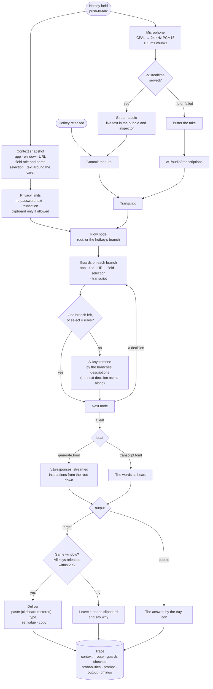
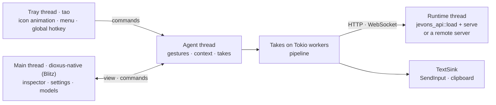

<p align="center"></p>

# jevons-desktop

Context-aware dictation and small automations from the tray. Press the hotkey in any application and speak. jevons-desktop reads where you are, transcribes you, and walks its flow tree (a folder of TOML files, one folder per step) to a leaf that types into the field you started in, answers you in a bubble, or calls a tool.

It runs the jevons models in-process, optionally exposing the API on a port, or uses a jevons server elsewhere. The platform-free behaviour lives in [`jevons-desktop-core`](../jevons-desktop-core). This crate adds the tray, the window and the per-OS layers. The full guide is [docs/desktop.md](../../docs/desktop.md).

## The tray icon


From left to right:
- **Ready** (cyan): the models are loaded.
- **Loading** (blue): the models are loading; dictation is not ready yet.
- **Tuning** (amber): GPU kernels are being autotuned for this model. This only happens on the first runs on a machine, and the results are saved; the tooltip says so.
- **No models** (grey): nothing is loaded; download or choose models in the Models tab.
- **Failed** (red): the last take failed; the inspector says why.
- **Listening:** the waveform follows your voice.
- **Transcribing:** green dots.
- **Writing:** violet dots, while the decision and generation run.

The tray and taskbar icon is drawn in code (`jevons-desktop-core::icons`), simplified from the [artwork](assets/jevons.png) so it stays legible at 16–32 px. To regenerate the images after changing it:

```bash
cargo run -p jevons-desktop-core --example render_icons -- crates/jevons-desktop/assets
```

## From speech to a leaf



1. **At the press** the app captures the context, before your focus can move, and opens the microphone. The context comes from UI Automation on Windows; other platforms read only the active window for now.
2. **While you speak** the audio streams to Realtime transcription, and the feedback bubble and the inspector show live text. When Realtime is not served, the take is uploaded when you finish.
3. **The flow tree** routes the take. Guards (rules on the context and the transcript) drop branches with no model call, rules decisions pick by priority, and the decision model chooses the rest by the branches' descriptions, one merged request per take when it can. The inspector shows the route for the window in front, with every rule it checked.
4. **The leaf** writes with the language model, following the instructions gathered from the root down, or uses the words as heard.
5. **Delivery** goes only into the window the take started in, once every key is released. Otherwise the text waits on the clipboard. Answers stream into the bubble instead, which then takes clicks for **Copy**, **Insert** and **Close**; before a tool runs, the bubble asks (Enter runs it, Esc cancels).

In **live dictation** (its own hotkey, held while speaking or pressed to start and stop), the app ends a phrase at each pause and the feedback bubble above the tray icon shows the words as they are recognized. When you stop, the whole transcript goes from *Transcript* through the steps above. The bubble follows push-to-talk takes too: what was heard, the route and the outcome. The tray menu's **Live feedback** turns it off.

## Threads



## Run

```bash
cargo run --release --locked -p jevons-desktop                 # tray, window, embedded models
cargo run --release --locked -p jevons-desktop --no-default-features   # remote server only
cargo run -p jevons-desktop -- --replay examples/speech-en.flac \
  --context examples/desktop/context-slack.json               # one take, trace as JSON
cargo run -p jevons-desktop -- --transcript "reply that I agree" \
  --context examples/desktop/context-slack.json               # the same, from text
cargo run -p jevons-desktop -- --check-flows                  # check the flows folder
```

Building needs Python 3: Blitz's CSS engine (stylo) generates code with it at build time. On Windows, install it from python.org or with `winget install Python.Python.3.12` (the Microsoft Store `python.exe` alias is not enough; set `PYTHON3` to the real interpreter if needed), and turn Smart App Control off, since it blocks the unsigned build scripts cargo compiles. On Linux the build also needs `libgtk-3-dev libxdo-dev libayatana-appindicator3-dev libasound2-dev libssl-dev`.

The default build embeds the runtime and must be built on Windows (MSVC and the HIP SDK, as in CI). The embedded stack's `cubecl-llvm` links a prebuilt LLVM for the host, so it cannot cross-compile.

For a quick remote-only Windows build from WSL, use [cargo-xwin](https://github.com/rust-cross/cargo-xwin) with clang 19 or newer (`clang-cl`, `lld-link`) on `PATH`:

```bash
PATH=/usr/lib/llvm-19/bin:$PATH cargo xwin build --release -p jevons-desktop \
  --no-default-features --target x86_64-pc-windows-msvc
```

## Layout

| Module | Role |
| --- | --- |
| `agent` | Hotkey gestures, context capture, takes, trace history, the shared view |
| `tray` | tao event loop: tray icon frames, menu, global hotkey |
| `audio` | CPAL capture: downmix, resample to 24 kHz, 100 ms chunks, meter |
| `runtime` | Embedded models (private loopback or exposed port) or a remote server |
| `platform` | Per-OS `ContextProvider` and `TextSink`; `windows` uses UI Automation, enigo and the clipboard |
| `ui` | The dioxus-native window: the context and its route, takes, the flow tree, settings, models (catalog and downloads); `components.rs` and `style.css` follow [Dioxus Components](https://dioxuslabs.com/components/), written for Blitz (in-window overlays instead of popovers, no JavaScript) |
