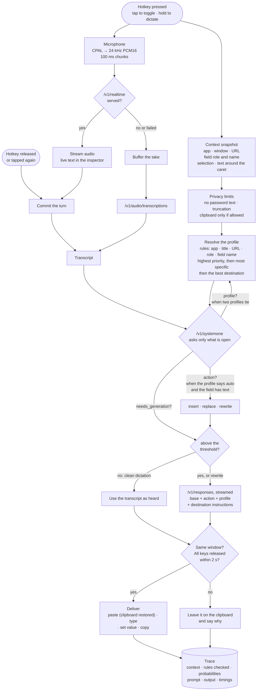
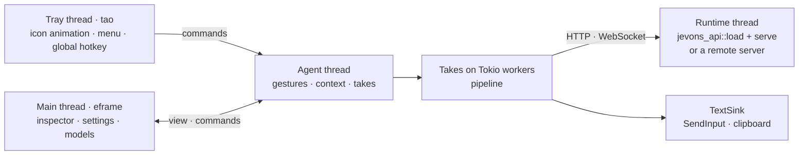

# jevons-desktop

Context-aware dictation from the tray. Press the hotkey in any application and speak. jevons-desktop reads where you are, transcribes you, picks a profile for that place, decides what to do with your words, and types the result into the field you started in.

It runs the jevons models in-process, optionally exposing the API on a port, or uses a jevons server elsewhere. The platform-free behaviour lives in [`jevons-desktop-core`](../jevons-desktop-core). This crate adds the tray, the window and the per-OS layers. The full guide is [docs/desktop.md](../../docs/desktop.md).

## From speech to inserted text



1. **At the press** the app captures the context, before your focus can move, and opens the microphone. The context comes from UI Automation on Windows; other platforms read only the active window for now.
2. **While you speak** the audio streams to Realtime transcription, and the inspector shows live text. When Realtime is not served, the take is uploaded when you finish.
3. **The profile** comes from rules you write in TOML. The inspector shows every rule it checked against the real context, so a mismatch is easy to spot.
4. **The decision model** answers only the open questions: which action (only when the profile says `auto` and there is text to act on), whether the words need editing, and which profile when two tie. Clean dictation skips generation entirely.
5. **Generation** follows the base prompt, then the action, then the profile's and the destination's instructions.
6. **Delivery** goes only into the window the take started in, once every key is released. Otherwise the text waits on the clipboard.

## Threads



## Run

```bash
cargo run --release --locked -p jevons-desktop                 # tray, window, embedded models
cargo run --release --locked -p jevons-desktop --no-default-features   # remote server only
cargo run -p jevons-desktop -- --replay examples/speech-en.flac \
  --context examples/desktop/context-slack.json               # one take, trace as JSON
```

On Linux the build needs `libgtk-3-dev libxdo-dev libayatana-appindicator3-dev libasound2-dev libssl-dev`.

To build the Windows app from WSL without the embedded runtime, use [cargo-xwin](https://github.com/rust-cross/cargo-xwin), with `clang-cl` and `lld-link` on `PATH`:

```bash
PATH=/usr/lib/llvm-18/bin:$PATH cargo xwin build --release -p jevons-desktop \
  --no-default-features --target x86_64-pc-windows-msvc
```

## Layout

| Module | Role |
| --- | --- |
| `agent` | Hotkey gestures, context capture, takes, trace history, the shared view |
| `tray` | tao event loop: tray icon frames, menu, global hotkey |
| `audio` | CPAL capture: downmix, resample to 24 kHz, 100 ms chunks, meter |
| `runtime` | Embedded models (private loopback or exposed port) or a remote server |
| `platform` | Per-OS `ContextProvider` and `TextSink`; `windows` uses UI Automation, enigo and the clipboard |
| `ui` | Context and resolution, takes, profiles, settings, models (catalog and downloads) |
