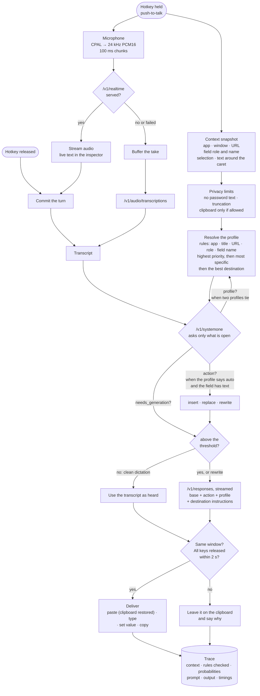
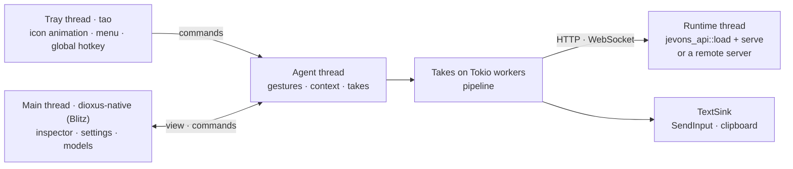

<p align="center"></p>

# jevons-desktop

Context-aware dictation from the tray. Press the hotkey in any application and speak. jevons-desktop reads where you are, transcribes you, picks a profile for that place, decides what to do with your words, and types the result into the field you started in.

It runs the jevons models in-process, optionally exposing the API on a port, or uses a jevons server elsewhere. The platform-free behaviour lives in [`jevons-desktop-core`](../jevons-desktop-core). This crate adds the tray, the window and the per-OS layers. The full guide is [docs/desktop.md](../../docs/desktop.md).

## The tray icon


From left to right:
- **Ready** (cyan): the models are loaded.
- **Tuning** (amber): GPU kernels are being autotuned for this model. This only happens on the first runs on a machine, and the results are saved; the tooltip says so.
- **Not ready** (grey): the models are still loading.
- **Failed** (red): the last take failed; the inspector says why.
- **Listening:** the waveform follows your voice.
- **Transcribing:** green dots.
- **Writing:** violet dots, while the decision and generation run.

The tray and taskbar icon is drawn in code (`jevons-desktop-core::icons`), simplified from the [artwork](assets/jevons.png) so it stays legible at 16–32 px. To regenerate the images after changing it:

```bash
cargo run -p jevons-desktop-core --example render_icons -- crates/jevons-desktop/assets
```

## From speech to inserted text



1. **At the press** the app captures the context, before your focus can move, and opens the microphone. The context comes from UI Automation on Windows; other platforms read only the active window for now.
2. **While you speak** the audio streams to Realtime transcription, and the inspector shows live text. When Realtime is not served, the take is uploaded when you finish.
3. **The profile** comes from rules you write in TOML. The inspector shows every rule it checked against the real context, so a mismatch is easy to spot.
4. **The decision model** answers only the open questions: which action (only when the profile says `auto` and there is text to act on), whether the words need editing, and which profile when two tie. Clean dictation skips generation entirely.
5. **Generation** follows the base prompt, then the action, then the profile's and the destination's instructions.
6. **Delivery** goes only into the window the take started in, once every key is released. Otherwise the text waits on the clipboard.

In **live dictation** (its own hotkey, press to start and again to stop), the server ends a turn at each pause, and every turn goes from *Transcript* through the same steps while the microphone stays open.

## Threads



## Run

```bash
cargo run --release --locked -p jevons-desktop                 # tray, window, embedded models
cargo run --release --locked -p jevons-desktop --no-default-features   # remote server only
cargo run -p jevons-desktop -- --replay examples/speech-en.flac \
  --context examples/desktop/context-slack.json               # one take, trace as JSON
```

On Linux the build needs `libgtk-3-dev libxdo-dev libayatana-appindicator3-dev libasound2-dev libssl-dev`.

The default build embeds the runtime and must be built on Windows (MSVC and the HIP SDK, as in CI). The embedded stack's `cubecl-llvm` links a prebuilt LLVM for the host, so it cannot cross-compile.

For a quick remote-only Windows build from WSL, use [cargo-xwin](https://github.com/rust-cross/cargo-xwin) with clang 19 or newer (`clang-cl`, `lld-link`) on `PATH`:

```bash
PATH=/usr/lib/llvm-19/bin:$PATH cargo xwin build --release -p jevons-desktop \
  --no-default-features --target x86_64-pc-windows-msvc
```

## Layout

| Module | Role |
| --- | --- |
| `agent` | Hotkey gestures, context capture, takes, trace history, the shared view |
| `tray` | tao event loop: tray icon frames, menu, global hotkey |
| `audio` | CPAL capture: downmix, resample to 24 kHz, 100 ms chunks, meter |
| `runtime` | Embedded models (private loopback or exposed port) or a remote server |
| `platform` | Per-OS `ContextProvider` and `TextSink`; `windows` uses UI Automation, enigo and the clipboard |
| `ui` | The dioxus-native window: context and resolution, takes, profiles, settings, models (catalog and downloads); `components.rs` and `style.css` follow [Dioxus Components](https://dioxuslabs.com/components/), written for Blitz (in-window overlays instead of popovers, no JavaScript) |
