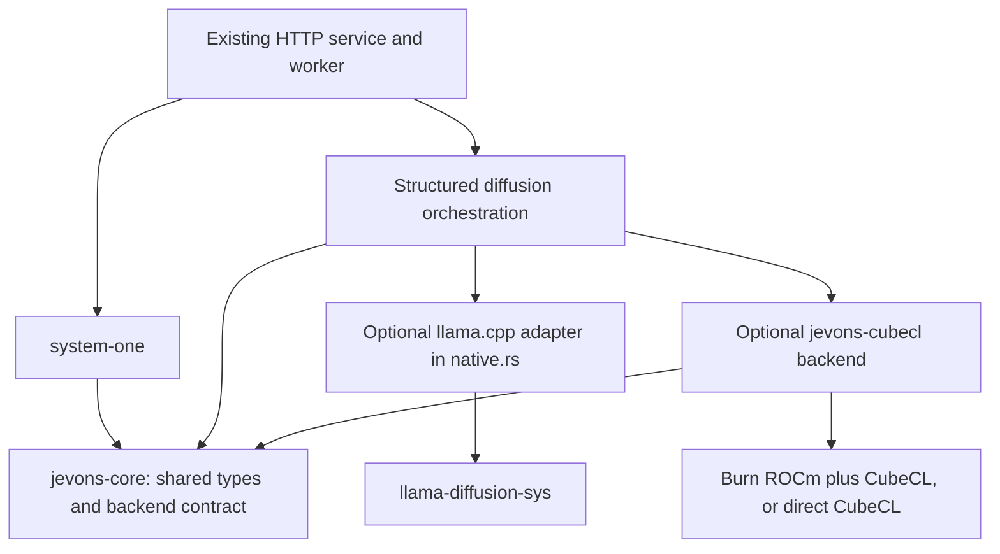

# CubeCL inference migration plan

Status (2026-09-23): **a complete CubeCL backend runs the full model.** GGUF loading, an
exact Gemma 4 tokenizer port, quantized GEMM/attention/MoE kernels, prompt prefill with exact
prefix reuse, canvas reads, self-conditioned refinement and thoughts all run on CubeCL/HIP and
are selectable with `--backend cubecl` in a build that does not link llama.cpp. On the Snake
workload, prefill median latency is 0.49x and request latency 0.51x of the committed llama.cpp
baseline, with matching answer labels
([report](../benchmarks/cubecl/results-model-2026-09-23/README.md),
[backend guide](cubecl.md)). Image input also runs on CubeCL (phase 6: a port of the Gemma 4
vision encoder), and the llama.cpp backend, `llama-diffusion-sys` and the submodule have been
removed. The sections below are the original plan and describe the repository as it was then;
earlier kernel experiments are listed in [the benchmark README](../benchmarks/cubecl/README.md).

## Scope and starting point

Port the existing DiffusionGemma inference path to Rust GPU execution using
[CubeCL](https://github.com/tracel-ai/cubecl), initially targeting the local AMD/ROCm
machine. Preserve the System One HTTP contract and the model's structured-answer
semantics. **Prefill latency is the primary performance objective**, following the
user's observation that it appears to dominate current requests. Establish and
improve fresh-prompt prefill before spending effort on canvas-only optimizations.
CubeCL provides kernel compilation and execution infrastructure; this
requires implementing or assembling a model runtime, not replacing one API call.
See [upstream research](cubecl-research.md) for verified capabilities and sources.

- Worktree: `/home/zaca/Development/rust/llama-cpp-system-one-cubecl`.
- Branch: `experiment/cubecl-inference`.
- Base: `0e3a62fdececf5ccb69b705ae8d1bde38716d3f2` (`development` at creation).
- Reference native revision: `12e0a9627d02c6395fd4bbf2aadff93d0d46a0e4`.
- Starting point and target confirmed by the user: committed HEAD; existing
  DiffusionGemma on local AMD/ROCm.
- Original checkout's uncommitted code, instrumentation, prompt-cache changes,
  and interop benchmarks are excluded. If later adopted, record them as a separate
  baseline change and regenerate comparison results.
- The initial plan was documentation-only. Implementation now adds optional
  Burn/CubeCL dependencies, native builds, and local GPU checks; no model assets
  are downloaded. Results are recorded under `benchmarks/cubecl/`.

The [local build guide](build.md#rocmhip) documents ROCm 7.2.1, WSL, `gfx1151`, and
`diffusiongemma-26B-A4B-it-Q4_K_M.gguf`. These are the initial test configuration,
not evidence that CubeCL works on this machine. Confirm the actual device, memory,
driver, SDK, and model metadata in phase 0. Model files remain external assets.

## Prefill performance workstream

### Existing evidence and baseline separation

The original checkout's local
[interop report](../../llama-cpp-system-one/benchmarks/interop/README.md) and
[GPU profile](../../llama-cpp-system-one/benchmarks/interop/profiling-2026-09-21/README.md)
support prioritizing prefill. These links refer to uncommitted sibling-checkout
artifacts, not files included in this experiment's base; capture their provenance
and reproduce measurements in phase 0 before treating them as acceptance data.

- The untraced profiling baseline reports median total/prefill/canvas times of
  **1005.8 / 900.4 / 100.9 ms**. Individual phase medians need not sum to total.
- In the traced eight-request run, quantized `mul_mat_q` kernels consumed
  **585.9 ms/request**, **69% of summed prefill kernel durations**. Q4_K was the
  largest specialization; Q5_0 and Q8_0 were also substantial. Kernel families
  alone do not distinguish dense projections from routed expert work.
- The interop workload had 464–468 prompt tokens, eight canvas tokens, and three
  or four executed prefill batches. Rust and standalone C++ retained comparable
  latency and exactly matching outputs. Full previous-prompt cache hits did not
  explain those results.
- Tracing increased measured latency. Synchronization API time overlaps GPU
  execution and must not be added to kernel time or called removable overhead.
  Without hardware counters, the trace does not establish compute versus memory
  bandwidth limitation.

### Measurement contract

Add the benchmark harness and timing boundaries during phase 0, before choosing
the compute abstraction. Record preparation, synchronized prefill wall time,
canvas time, worker inference time, and HTTP/queue time separately. `forward_ms`
excludes prefill in the existing implementation, so it cannot be the migration's
primary speed metric. Use device events where supported for kernel attribution;
avoid per-operation synchronization in ordinary benchmark runs. Include pending
prefill work in the prefill timing boundary rather than charging it to the canvas.

Benchmark a warm model with a deliberately empty prompt cache separately from
process-cold loading/JIT. Use the same compiled token sequences on both engines:

| Workload | What it establishes |
| --- | --- |
| Fresh, changing prompts, including the existing Snake workload | Primary acceptance workload: useful speed without full cache hits. |
| Identical prompt repeated | Full prefix-cache benefit, reported separately from kernel throughput. |
| Same-length prompts with changes near the beginning, middle, and end | Reuse actually available before the first changed token. |
| Growing and shrinking prompts | Cache capacity/reallocation behavior and correctness. |
| Multiple samples and question chunks; later, sequential/thought extensions | Avoidable repeated prefill inside one request. |
| Approximately 128, 512, 2048, and 4096 prompt tokens, plus the largest valid prompt | Scaling of prefill time and memory; reserve space for framing and canvas. |

Report p50/p95 phase latency, peak memory, executed prefill batches, and logical,
reused, and actually processed prompt tokens. Compute fresh-token throughput from
processed tokens and prefill time; do not present full-cache hits as kernel
tokens/second. Use enough repetitions for meaningful percentiles, alternate engine
run order, and report variability. Keep logical API usage independent of reuse.

### Optimization order and acceptance

1. **Quantized matrix multiplication and expert execution:** benchmark actual
   prefill tensor shapes, batch sizes, tensor formats, and routed token counts on
   `gfx1151`. Compare supported tiling, grouped expert execution, and fused/tiled
   dequantization approaches within the memory budget. Inspect whether Burn's
   graph introduces intermediate copies or prevents efficient kernels. Generic
   dense matmul or one-token decode performance is insufficient evidence.
2. **Remove unnecessary prefill work:** implement a KV-only prefill path that
   avoids unused vocabulary output projection/logit materialization wherever the
   graph permits. Keep canvas output capacity separate. Measure the benefit and
   verify subsequent canvas logits; the existing trace does not isolate its cost.
3. **Batching and attention:** sweep legal chunk sizes (initial candidates 128,
   256, 512, and 1024), coalesce small text parts after tokenization, and profile
   causal/sliding/global attention. Preserve exact token IDs and visibility rules;
   concatenating text before tokenization can change inputs. Validate any fused
   attention path against the reference and measure its memory tradeoff.
4. **Prefix reuse:** retain validated prompt KV across samples/non-sequential
   chunks and compatible successive requests. Reuse only identical leading token
   spans with matching model/position/attention configuration; recompute from the
   first change. Explicitly handle growth, capacity changes, errors, and images.
   Test cached versus fresh execution, including A/B/A requests. Never reuse a
   changed earlier state just because later question text is unchanged. Preserve
   prompt order during this experiment so cache gains do not alter model inputs.
5. **Dispatch and allocation:** measure launch gaps, graph construction, temporary
   allocations, transfers, and barriers; optimize demonstrated costs while keeping
   required synchronization. Confirm every improvement in untraced runs.

These are ordered experiments, not assumed speedups. Establish numerical and
memory limits plus a quantitative prefill improvement target after reproducing
the baseline, **before** optimizing the port. Promote the backend only when it
meets that target on changing prompts and improves end-to-end latency without
unacceptable p95 or memory regressions. Report fresh-prefill kernel gains and
cache-policy gains separately, with matched-cache comparisons where supported.
If the first complete forward cannot show a credible path to that goal, revisit
kernel choices or the Burn/direct-CubeCL decision before porting more features.

## What must be preserved

The implementation boundary is currently wider than `native.rs`:

| Existing component | Migration treatment |
| --- | --- |
| `system-one/{request,compiler,response}.rs` | Preserve validation, code assignment, prompt framing, answer mapping, and usage semantics. Replace its dependency on native-linked types with shared Rust types. |
| `jevons-rs/src/worker.rs` | Keep the bounded queue and dedicated inference thread. Construct and own the selected backend inside that thread. |
| `jevons-engine/src/engine.rs` | Reuse token preparation, seeded noise, canvas chunking, sampling orchestration, and thought logic; remove direct dependence on native batches. |
| `read.rs`, `denoise.rs`, `probability.rs` | Preserve public data and numerical semantics; use existing pure Rust behavior as the reference. |
| `jevons-engine/src/native.rs` | Retain as the llama.cpp adapter/reference. Its tokenizer, model loading, prompt cache, canvas evaluation, and vision services each need an alternative. |
| `llama-diffusion-sys` and CMake wrapper | Keep available for comparison; exclude them from the CubeCL-only server dependency graph. Do not edit the submodule. |

Source of truth: [engine](../crates/jevons-engine/src/engine.rs),
[native adapter](../crates/jevons-engine/src/native.rs),
[worker](../crates/jevons-rs/src/worker.rs),
[inference behavior](inference.md), and the pinned native
[DiffusionGemma graph](https://github.com/ggml-org/llama.cpp/blob/12e0a9627d02c6395fd4bbf2aadff93d0d46a0e4/src/models/diffusion-gemma.cpp)
and [Gemma 4 helpers](https://github.com/ggml-org/llama.cpp/blob/12e0a9627d02c6395fd4bbf2aadff93d0d46a0e4/src/models/gemma4-common.h).

In particular, this is not ordinary autoregressive decoding. Text prefill is
causal, canvas attention is bidirectional, and sliding/global layers have distinct
visibility rules. Prompt and canvas embeddings and layer scalars differ. The
backbone includes a shared dense expert plus routed experts, specialized router
normalization/scaling, Q/K normalization, V normalization/reuse, and partial or
proportional RoPE. Later denoising steps consume previous full-vocabulary logits
through the self-conditioning network. Port the pinned graph and metadata rather
than substituting a generic Gemma implementation.

## Proposed architecture

Start with a small feasibility comparison between **Burn on its CubeCL-backed
ROCm backend** and **direct CubeCL**. Burn is the preferred starting hypothesis
for tensor allocation and ordinary operations; custom CubeCL kernels can cover
quantized matmul and model-specific gaps. Choose direct CubeCL if the measured
quantization, expert routing, or memory requirements make Burn an obstacle.
Neither option is assumed to provide a ready-made DiffusionGemma runtime.

Proposed dependency structure (names are provisional):



- Extract read/request/result/error types and the backend contract into a small
  `jevons-core` crate with no native dependency. Re-export existing public
  types from the structured crate to limit churn. Keep sampling math in the
  orchestration layer unless an actual dependency requires moving it.
- The contract covers model capabilities/limits, tokenizer and token pieces,
  prompt preparation/prefill, canvas evaluation, candidate logits, full logits,
  synchronization, and request-state reset. Keep native `Batch` and device buffers
  inside adapters; do not make C pointers part of the interface.
- Make KV-only prefill, backend-owned reusable prompt state, explicit cache
  invalidation, and prefill timing/work counters part of the initial design.
  Separate clearing request-local canvas/self-conditioning state from evicting a
  validated prompt prefix. Avoid an interface that forces full re-prefill or a
  host synchronization after every layer.
- Initially permit owned host logits for parity. Later allow backend-owned
  previous-step state to avoid repeated full-vocabulary transfers without
  changing sampling semantics. Model/context ownership remains on the worker;
  do not require `Send + Sync` merely to fit an interface.
- Separate common configuration from backend settings. Existing `gpu_layers`,
  `threads`, `flash_attention`, and `mmproj` settings do not automatically map to
  CubeCL. Reject unsupported settings explicitly; avoid silently ignoring them.
- Keep llama.cpp as the default while the experiment is incomplete. Proposed
  features are `llama` and `cubecl-hip`, with an explicit startup engine selector
  when both are compiled. Existing `hip`/`cuda` remain llama.cpp build choices.
  Final feature names are decided during implementation.
- A CubeCL-only server build must not run bindgen/CMake or link llama/ggml. Because
  the workspace includes `llama-diffusion-sys`, this guarantee applies to selected
  package builds; building every workspace member still includes native code.
- Preserve the repository's unsafe-code boundary. Prefer safe compute APIs. If
  chosen kernel launch APIs require handwritten unsafe, resolve their placement
  within the existing allowed boundary before adopting them; do not silently add
  unsafe blocks to a new crate against `AGENTS.md`.

## Phases and exit gates

### 0. Establish feasibility and the reference

1. Record GPU architecture, usable memory, ROCm/WSL driver versions, Rust toolchain,
   model hash, tensor shapes/types, tokenizer metadata, and pinned dependency
   versions. Evaluate the verified release pairing Burn 0.21.0 / CubeCL 0.10.0 /
   CubeK 0.2.0 first. CubeCL 0.10.0 requires Rust 1.92, so explicitly update the
   experiment's toolchain/MSRV or verify a suitable older dependency combination;
   this workspace currently declares 1.88. Do not follow upstream main implicitly.
2. Build a standalone HIP probe with buffer upload/download, elementwise work,
   reduction, and matrix multiplication at representative dimensions. Check
   numerical results, synchronization, allocation failure reporting, and repeated
   execution on `gfx1151`. Do not assume the existing GGML environment flags
   configure CubeCL.
3. Compare Burn ROCm and direct CubeCL for quantized-weight access, expert indexing,
   attention masks, memory ownership, and required unsafe calls. Include the
   representative prefill workloads above in this decision, not just a trivial
   HIP probe. Pin compatible versions/revisions and document the choice.
4. Initialize the pinned submodule in this worktree when reference builds begin.
   Run existing checks and native reproducibility tests. Create a small parity
   harness that stores synthetic prompts, code/token IDs, initial canvases,
   candidate logits, probabilities, usage, and timing. Never store private prompts
   or model weights in fixtures.
5. Set numerical tolerances from the reference precision and repeated runs before
   judging the port. Record max/RMS logit error, maximum probability error, and
   label disagreement; near-tied labels need separate interpretation.
6. Reproduce the prefill breakdown and set the fresh-prompt latency acceptance
   target. Keep the committed baseline and any separately captured original
   checkout optimizations labeled distinctly; do not attribute baseline changes
   to CubeCL. Select kernel experiments from measured prefill costs.

**Exit:** a real HIP kernel and matmul pass on the target machine, the dependency
choice is reproducible, reference fixtures and a prefill baseline exist, and the
performance target is recorded. If blocked, resolve the
specific driver/compiler/device problem before starting the model port.

### 1. Introduce the backend boundary using llama.cpp only

Extract shared types and implement the adapter interface around the current
`Native`. Move native batch ownership out of `Engine`. Add capability checks that
run before expensive inference. Preserve error mapping, framing, noise, and
probability behavior. Keep all existing native functionality available.

**Exit:** regular checks, HTTP/queue tests, and existing native reproducibility
and extension tests pass through the adapter. `jevons-system-one` can build/test without
native model code. No CubeCL implementation is required for this gate.

### 2. Load the actual model and reproduce tokenization

Inventory the user's GGUF file before choosing a loader. `Q4_K_M` is a quantization
preset, not a guarantee that every tensor uses one encoding. Implement or reuse
a reviewed GGUF metadata/tensor reader, validate dimensions and bounds, and
support every encoding actually encountered. Compare dequantized blocks against
the pinned GGML reference. Preserve tensor layout, scales, and expert ordering.

Compare token IDs, BOS/EOS and control markers, Unicode, whitespace, token pieces,
special-token handling, and all 128 selected answer codes against llama.cpp.
Preserve the separation between trusted chat framing and literal user content.
A compatible external tokenizer artifact may be used only after proving that its
vocabulary and behavior match this model; vocabulary size alone is insufficient.

Use a memory budget before full loading:

`peak memory = resident weights + prompt KV + activations + expert workspace + logits/self-conditioning + temporary copies`.

The model's 4B active parameters do not imply that only 4B parameters must be
stored. At roughly 26B parameters, two-byte weights alone are about 52 GB decimal,
before caches and scratch. Whole-model dequantization is not the default plan.
Use tiny/block fixtures for float correctness first, then packed quantized storage
and tiled dequantization/matmul. A converted checkpoint is a separate experiment
requiring its own memory and numerical comparison, not automatic GGUF parity.

**Exit:** exact tokenizer/code parity, validated quantized tensor decoding, and a
measured memory plan that fits the target hardware. Missing formats are reported
clearly rather than approximated silently.

### 3. Implement one text-only DiffusionGemma canvas read

Port embedding lookup and region-specific scaling, RMSNorm variants, projections,
RoPE, attention masks, routed/shared experts, residuals/layer scalars, and output
projection. Validate small shapes and intermediate layers before a full forward.
Implement chunked causal prompt prefill and bidirectional canvas evaluation using
the prompt KV cache; reset state safely between requests and after errors.

Initial supported options: `steps=1`, `samples=1`, `think=0`, `sequential=false`,
no images. Begin with one canvas of at most 64 tokens, then enable ordinary
non-sequential chunking with the same prompt and seed rules. Reject all unsupported
extensions explicitly. A tiny synthetic network validates operators; it does not
replace the real DiffusionGemma acceptance test.

**Exit:** the actual existing quantized model completes the SCM fixture and
System One example; token IDs, canvas positions, and usage match exactly;
probabilities/logits meet the predeclared tolerances. Request A, then B, then A
shows no stale-state contamination. Record cold and warm latency and peak memory.
Run the prefill workload matrix and the prioritized kernel experiments now,
before extension work. Evaluate the fresh-prefill target and document whether to
continue with the chosen compute layer or revise it. Canvas parity alone does
not pass the performance gate.

This is the first useful prototype and the main decision point for continued work.

### 4. Restore structured inference extensions

Add repeated samples and probability averaging, sequential chunk context, the
full-logit self-conditioning network and entropy-bound refinement, then bounded
thought generation with delimiter handling. Preserve ChaCha8 RNG draw order,
sample/chunk seed offsets, fixed template tokens, and logical usage accounting.
Introduce device-resident self-conditioning only after the simpler path passes
parity checks. Retain capability errors for anything still unsupported.

**Exit:** existing extension scenarios pass on both engines within the chosen
numerical criteria; independent requests/samples cannot inherit stale logits.
Seeded initialization is exact; cross-backend float results are not assumed to
be bitwise equal. Test reproducibility within each backend separately.

### 5. Integrate the server and measure practical performance

Expose explicit backend selection; retain authentication, queue bounds, model
aliases, health/readiness behavior, and error handling. Test a CubeCL-only package
build with no native submodule available and inspect its dependency graph and
linkage. Implement clear startup validation for incompatible backend flags.

Benchmark both engines using identical assets, compiled prompts, options, seeds,
hardware, and comparable warmup/cache policies. Measure load/JIT separately from
steady-state work. Report preparation, prefill, canvas, transfers, end-to-end
latency, memory, and throughput. Use repeated runs and distributions; a short
prompt result cannot establish general speed superiority. Recheck the prefill
target and workload matrix established in phase 0 under the integrated service.
Measure queue effects separately from isolated inference. Preserve a simple
correctness path while extending the prefill optimizations validated in phase 3.

**Exit:** smoke/HTTP/queue tests pass; CubeCL-only execution has no llama.cpp
dependency; a reproducible report establishes accuracy, memory, and performance
tradeoffs. Keep the existing backend selectable until the replacement meets the
chosen acceptance criteria.

### 6. Complete vision parity and decide the default

Port image preprocessing, the actual projector/vision architecture and weights,
image delimiters, patch embeddings, and image-prefill attention/scaling behavior.
The current CMake overlay's image semantics are part of the reference. An interim
hybrid using `mtmd` must be labeled hybrid and cannot pass the no-llama dependency
gate for full replacement.

**Exit:** image inference and subsequent text reproducibility pass against the
reference. All currently supported request features are implemented before calling
this a complete replacement or changing the default. Update README, build/API
documentation, configuration examples, and prerequisites for the final behavior.

## Validation commands and artifacts

For the unchanged native baseline, after installing documented prerequisites and
setting the model/runtime environment:

```bash
git submodule update --init --recursive
cargo fmt --all -- --check
cargo clippy --workspace --all-targets --locked -- -D warnings
cargo test --workspace --locked
cargo test -p jevons-engine --locked --features hip,native \
  native_reads_preserve_reproducibility_across_requests -- --ignored --nocapture
```

Also run the existing native extension and image tests when their features change;
image tests require `DIFFUSION_MMPROJ`. Use `scripts/smoke-test.py` against each
running server. Do not use `--all-features`. CubeCL feature-specific commands will
be added after phase 1 fixes their actual names and dependency matrix; they are
not available in the current checkout.

Keep the comparison harness and synthetic fixtures under a new
`benchmarks/cubecl/` directory. Record dependency/toolchain/model revisions,
tolerances, capability coverage, memory estimates versus measurements, and timing
methodology alongside results. Do not claim existing tests pass on the new
backend until they have actually run.

## Suggested implementation slices

1. HIP feasibility probe, prefill profiling/baseline, performance target, and dependency decision.
2. Shared inference types and llama.cpp adapter with unchanged behavior.
3. GGUF/tensor loading, tokenizer parity, and memory accounting.
4. Tested model operators, one full text canvas read, and the fresh-prefill performance gate.
5. Multi-step/sample/sequential/thought parity.
6. Server selection, native-free build, and benchmark report.
7. Vision parity, final documentation, and default-backend decision.

The largest uncertainties are model-specific quantized kernels, memory on the
target device, and ROCm/WSL compatibility. Treat this as a staged model-runtime
project. Estimate the full port only after phases 0 and 2 establish those facts;
a dependency-swap estimate would hide most of the work.
