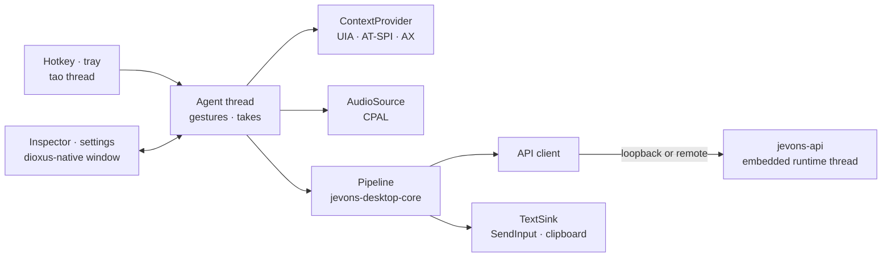

# Desktop app


`jevons-desktop` is a tray app for context-aware dictation and small automations. Press the hotkey in any application and speak. The app reads which application and field you are in, transcribes you, and walks its **flow tree**: a folder of TOML files where each folder is a step. Decisions pick a branch by rules and by the decision model, and the branch it ends in types the text where you were, answers you in a bubble by the tray icon, or calls a tool.

```bash
cargo run --release --locked -p jevons-desktop
```

The first run opens the window when no tray is available; otherwise use the tray icon's menu. Settings live in `jevons-desktop.toml` in the platform configuration folder (`%APPDATA%\jevons\config` on Windows, `~/.config/jevons` on Linux). See [jevons-desktop.example.toml](../jevons-desktop.example.toml) for every field.

## Using it

- **Push-to-talk:** hold the hotkey (default `Ctrl+Alt+Space`) while speaking. Listening starts on the press, and releasing it sends the take through the flow below. A press too short to hold speech (under 0.4 s) is dropped quietly.
- **Hold or toggle:** each dictation hotkey either listens while held (the default) or starts on a press and stops on the next one. Push-to-talk and the branch hotkeys share one setting (`hotkey_mode`), and live dictation has its own (`live_hotkey_mode`). Both are `hold` or `toggle`, and Settings has a switch under each hotkey.
- **Live dictation:** hold its hotkey (default `F9`) while speaking, or press it to start and again to stop in toggle mode; the tray menu's **Start live dictation** toggles it too. While you speak, the feedback bubble shows the words as they are recognized. Nothing is typed until you stop: then the whole transcript goes through the flow tree, like a push-to-talk take. The app ends a phrase at each pause (0.7 s of quiet at the microphone, or every 20 s of nonstop speech) and keeps all the audio. While push-to-talk runs from a held hotkey, a keyboard hook drops that key's auto-repeats, which Windows would otherwise send to the focused application (a held F10 toggles most applications' menu bar).
- **Live feedback:** a bubble above the tray icon follows each take: the words as they are recognized, then the route through the flow tree, the text written, and whether it was inserted or left on the clipboard. Answers stay in it long enough to read. It never takes the focus, lets clicks through, and closes a few seconds after the take ends. Turn it off with the tray menu's **Live feedback** or in Settings.
- **Left-click** the tray icon to toggle dictation.
- **Other hotkeys** (set in Settings, by clicking a field and pressing the combination): one to show the inspector, and one per top-level branch of the flow tree to start the take there instead of at the root (such as a hotkey that always asks).
- **Start takes at:** the tray menu can start every take at one top-level branch until you set it back to the root.

The tray icon shows what is happening:

- the jevons alien, glowing cyan when ready, blue while the models load (not ready yet), and grey when no model is loaded;
- amber while GPU kernels are being tuned for the model, which only happens on the first runs and can take minutes (the tooltip and the window say so);
- a waveform that follows your voice while listening;
- green dots while transcribing;
- violet dots while deciding and writing;
- red after a failed take.

The context is read **when the hotkey is pressed**, so the text goes to the field you started in. It is delivered only into that same window, and only once every key is released. If you switched windows, or held keys for more than two seconds, the text stays on the clipboard and the inspector says so.

## How a take works

1. **Context.** The platform accessibility layer reads the focused application, window, field role and name, the selection and the text around the caret. For browsers it also reads the page address. Password fields are never read, text is truncated to `privacy.max_context_chars`, and the clipboard is read only when `privacy.read_clipboard` is on.
2. **Transcription.** Audio streams to `/v1/realtime` as 24 kHz PCM16, and the live text appears in the window. The app commits the turn itself when you finish. When Realtime is off or fails, the recording is uploaded to `/v1/audio/transcriptions` instead.
3. **Flow tree.** The walk starts at the root (or at the branch the hotkey names). At each decision, branches whose guards fail drop out; `select = "rules"` takes the highest priority, and otherwise `/v1/systemone` chooses by the branches' descriptions. When one decision leads straight into another, both are asked in one request, so dictation usually costs a single decision call. Investigations along the way read more of the screen (see below).
4. **Leaf.** A `generate.toml` leaf streams text from `/v1/responses` with the instructions gathered from the root down; a `transcript.toml` leaf uses the words as heard.
5. **Delivery.** Text for the application is pasted (the previous clipboard text is restored afterwards), typed, set through the accessibility API, or copied, as the path's `delivery` says. Answers show in the bubble; clipboard leaves copy.

Every step goes into a trace: the context, each node with the guards it checked, every decision request and its probabilities, the investigations, the exact prompt, the output, the delivery and the timings. The last 50 traces are in the **Takes** tab.

## The flow tree

The flow tree lives in the `flows` folder next to the settings file (`flows_dir` moves it). On the first run jevons writes the built-in tree there, with an `AGENTS.md` that documents the format for people and coding agents, a JSON Schema per node file in `_schemas/`, and a `.taplo.toml` that maps them for editors. The files reload as soon as you save them. A tree with problems is reported in the **Flows** tab with each file and line, and the last tree that loaded cleanly keeps running.

Each folder is a node, and the file in it names its kind:

| File | Does |
| --- | --- |
| `decide.toml` | chooses one of its subfolders (or the folders of a shared `_` folder named by `branches`) |
| `generate.toml` | writes text with the language model, for the application, the bubble or the clipboard |
| `transcript.toml` | uses the words as recognized, with no model |
| `tool.toml` | calls a tool registered in the settings |
| `agent.toml` | runs a tool-calling agent over registered tools |

A decision in the built-in tree:

```toml
# flows/dictate/chat/decide.toml
description = "A chat application"   # what the decision above chooses by
priority = 20                        # dictate/ chooses with select = "rules": highest wins
select = "rules"
fallback = "any"
instructions = "Casual and concise. Keep emoji and names exactly as dictated. No sign-off."

[when]                               # the guard: every rule set must pass, with no model call
app = ["slack.exe", "*teams*", "discord*", "whatsapp*", "telegram*"]
```

Guards can check the application, window title, page address, the focused field's role and name, whether text is selected, whether the field holds text, whether it is editable, and the transcript itself (`transcript = "(?i)^translate"`). Instructions add up from the root down, and each folder may add an `instructions.md`.

The built-in tree:

- `decide.toml` at the root asks what the user wants: **dictate** (the fallback) or **ask**.
- `dictate/` chooses by rules, per application: `code/` (only insert or type as heard), `chat/` (with `thread/` for replies), `web-mail/`, `notes/` and `any/`. Each takes its branches from the shared `_actions/` folder: `insert`, `replace` (with a selection), `rewrite` (with text in the field) and `verbatim` (the words as heard, no generation).
- `ask/` answers in the bubble; in chat apps (`chat/`, `web-chat/`) it first reads the open conversation with an investigation.

`AGENTS.md` in the folder is the full reference: every field, placeholders such as `{selection}` and `{chat.messages}`, investigations, tools, agents and the rules the loader enforces. [examples/desktop/flows](../examples/desktop/flows) is the built-in tree.

### Writing a branch against the real context

The **Context** tab shows what the platform reports for the focused window. It updates twice a second and ignores the inspector's own window. Use **Capture in 3 s**, then switch to the target application.

Below the snapshot, the **Route** card walks the tree for that window by guards and rules alone. It shows each decision's branches with every rule's pattern, the value it was compared with, and whether it passed, and it stops at the first decision the model would make. **Flows → New branch from the current context** writes a folder under a decision (such as `dictate`) whose guard matches that application, page and field (the exact window title is included as a commented-out rule), then opens it for you to add a description and instructions.

## Settings## Settings

The **Settings** tab edits the runtime, dictation and privacy settings. **Apply and save** writes them all at once.

- **Runtime.**
  - *Run the models in this app* loads them in-process.
  - By default the API is private: it listens on an ephemeral loopback port with a random key that only the app knows.
  - *Expose the API* serves it on the address and port you choose, so the OpenAI SDK, Open WebUI or `scripts/smoke-test.py` can use it. It takes the key from `TYPESAFE_API_KEY` or the settings; without a key the API is open.
  - Turning exposure on or off, or changing the port, rebinds the listener without reloading the models.
  - *Use a jevons server* skips local models and uses a server URL and key instead.
- **Dictation.** The hotkeys (push-to-talk, live dictation, inspector, and one per top-level branch), live feedback, the microphone, language (detected when empty), whether to ask the decision model (when off, decisions take their fallback), and the most tokens a generation may write unless a node sets its own.
- **Privacy.** How many characters of each field to keep, and whether to include the clipboard.

## Models

The **Models** tab manages the models the app runs.

- **Models folder.** Models live in `~/jevons/models` (`C:\Users\<you>\jevons\models`) unless you choose another folder. Each model goes in its own subfolder.
- **First start.** Nothing downloads by itself. Open the Models tab and press **Download** on DiffusionGemma (about 18 GB with its vision projector) and Parakeet (2.5 GB); once downloaded, they are used for every service without a selected model.
- **Catalog.**
  - When a service has no model selected, the first downloaded entry that serves it is used, in catalog order: DiffusionGemma for generative and decision, Parakeet for speech.
  - Built in: DiffusionGemma 26B-A4B Q4_K_M from [unsloth/diffusiongemma-26B-A4B-it-GGUF](https://huggingface.co/unsloth/diffusiongemma-26B-A4B-it-GGUF), Nemotron-Labs-Diffusion 3B and VLM 8B (generative and decision), and Parakeet TDT 0.6B v3 (speech).
  - The DiffusionGemma repository has no vision projector, so its entry also fetches `mmproj-diffusiongemma-26b-a4b-f16.gguf` from [FreedomAISVR/DiffusionGemma-26B-A4B-it-MXFP4-GGUF](https://huggingface.co/FreedomAISVR/DiffusionGemma-26B-A4B-it-MXFP4-GGUF) into the same folder.
  - **Download** fetches the files from Hugging Face. It resumes interrupted files with an HTTP range and checks each large file against the repository's SHA-256.
  - Nothing downloads unless you press the button. Set `HF_TOKEN` for gated repositories.
- **Selected models.** **Use for …** assigns a downloaded model to a service. **Use existing…** points a service at a model already on disk (a GGUF file or a checkpoint folder) without copying it. Generative and decision on the same model share one engine.
- **Other models.** Add a Hugging Face repository with file globs under *Add a Hugging Face model*, or write the entry into `models.toml` next to the settings file:

  ```toml
  [[models]]
  id = "diffusiongemma-q8"
  name = "DiffusionGemma 26B-A4B Q8_0"
  services = ["generative", "decision"]
  repo = "unsloth/diffusiongemma-26B-A4B-it-GGUF"
  files = ["*Q8_0.gguf"]
  model_file = "diffusiongemma-26B-A4B-it-Q8_0.gguf"
  memory_gb = 30
  ```

- **Existing settings file.** `models.runtime_config` loads an existing `jevons.toml` instead of the selections.

The panel shows the approximate memory of the selected models. On an APU, GPU memory is system memory, so load one large model at a time.

The app has no console window on Windows. Everything to review is in the `jevons` folder in your home directory (`C:\Users\<you>\jevons`, `~/jevons`), which **Open logs and traces** in the tray menu opens:

- `logs/jevons-desktop.log`: this run's log, with `jevons-desktop.previous.log` from the run before. Each take logs its steps and timings (transcribed, deciding, generating, delivered) but never your text. Set `RUST_LOG` for more detail.
- `traces/<time>-take<n>.json`: the full trace of each take, the same one the Takes tab shows (context, route with the guards checked, decision requests and probabilities, investigations, prompt, output, delivery). The newest 200 are kept.

The decision and generation have time limits (60 s and 120 s). When the decision model does not answer in time, decisions take their fallback and the words are used as heard; the trace says why. **Cancel the current take** in the tray menu abandons a take without typing anything.

## Headless runs

`--replay` runs one take from an audio file, and `--transcript` from text as if you had said it; both take a context snapshot and print the trace as JSON. They use the same settings (embedded or remote runtime, flow tree). Use them for scripted checks and to try a flow tree without speaking:

```bash
cargo run -p jevons-desktop -- --replay examples/speech-en.flac \
  --context examples/desktop/context-slack.json
cargo run -p jevons-desktop -- --transcript "what did Ana say about the launch?" \
  --context examples/desktop/context-slack.json --flow ask
```

`--flow` starts at a branch instead of the root, and `--deliver` types the result into the focused application.

`--check-flows [DIR]` checks a flows folder (the settings' one by default), printing every problem with its file and line, and fails when there is one. `--init-flows [DIR]` writes the built-in tree into a folder that has none and refreshes `AGENTS.md`, the schemas and `.taplo.toml`.

## Platform status

Every platform layer is a trait in `jevons-desktop-core::platform`. The pipeline, the flow tree, gestures, paste safety and tray states are shared, and each OS implements the layers:

| Layer | Windows | Linux | macOS |
| --- | --- | --- | --- |
| Context | UI Automation: role, name, selection, caret text, browser address | active window only (AT-SPI planned) | active window only (Accessibility API planned) |
| Text input | paste, type (SendInput) or set value (UI Automation) | clipboard (Wayland input method, X11 XTest, uinput planned) | clipboard (CGEvent planned) |
| Microphone | CPAL (WASAPI) | CPAL (ALSA/PulseAudio) | CPAL (CoreAudio) |
| Hotkey, tray | global-hotkey, tray-icon | global-hotkey (X11), tray-icon (AppIndicator) | not yet |

Platform code uses safe wrapper crates only; the desktop crates forbid `unsafe`.

## Architecture



- **Main thread:** the dioxus-native (Blitz) window, styled after [Dioxus Components](https://dioxuslabs.com/components/), which hides instead of closing.
- **Tray thread:** a tao event loop that owns the tray icon, menu and global hotkey, and animates the icon.
- **Agent thread:** handles hotkey gestures, reads the context, opens the microphone and starts takes. Takes run on its Tokio workers.
- **Runtime thread:** owns the loaded models (through `jevons_api::load`) and the listener (`jevons_api::serve`), so it can rebind without reloading.
