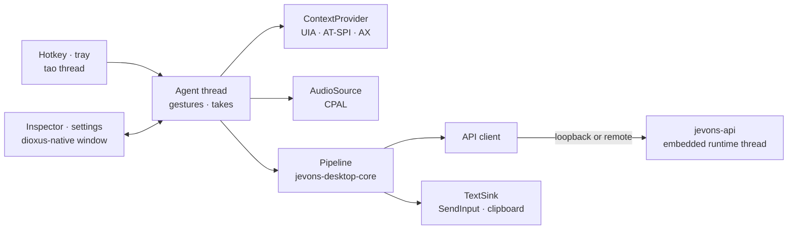

# Desktop dictation


`jevons-desktop` is a tray app for context-aware dictation. Press the hotkey in any application and speak. The app reads which application and field you are in, transcribes you, picks a profile for that place, decides whether to insert, replace or rewrite, generates the text when it needs editing, and types it where you were.

```bash
cargo run --release --locked -p jevons-desktop
```

The first run opens the window when no tray is available; otherwise use the tray icon's menu. Settings live in `jevons-desktop.toml` in the platform configuration folder (`%APPDATA%\jevons\config` on Windows, `~/.config/jevons` on Linux). See [jevons-desktop.example.toml](../jevons-desktop.example.toml) for every field.

## Using it

- **Push-to-talk:** hold the hotkey (default `Ctrl+Alt+Space`) while speaking. Listening starts on the press, and releasing it sends the take through the flow below. A press too short to hold speech (under 0.4 s) is dropped quietly.
- **Live dictation:** press its hotkey (default `Ctrl+Alt+L`) to start, and again to stop. Audio streams with server-side turn detection. After each pause (0.7 s), that phrase goes through the same flow and is typed while you keep talking. A space goes between phrases, and a selection applies only to the first phrase. It is also in the tray menu.
- **Left-click** the tray icon to toggle dictation.
- **Other hotkeys** (set in Settings, by clicking a field and pressing the combination): one to show the inspector, and one per profile to dictate with that profile whatever the context matches.

The tray icon shows what is happening:

- the jevons alien, glowing cyan when ready and grey while the models load;
- amber while GPU kernels are being tuned for the model, which only happens on the first runs and can take minutes (the tooltip and the window say so);
- a waveform that follows your voice while listening;
- green dots while transcribing;
- violet dots while deciding and writing;
- red after a failed take.

The context is read **when the hotkey is pressed**, so the text goes to the field you started in. It is delivered only into that same window, and only once every key is released. If you switched windows, or held keys for more than two seconds, the text stays on the clipboard and the inspector says so.

## How a take works

1. **Context.** The platform accessibility layer reads the focused application, window, field role and name, the selection and the text around the caret. For browsers it also reads the page address. Password fields are never read, text is truncated to `privacy.max_context_chars`, and the clipboard is read only when `privacy.read_clipboard` is on.
2. **Transcription.** Audio streams to `/v1/realtime` as 24 kHz PCM16, and the live text appears in the window. The app commits the turn itself when you finish. When Realtime is off or fails, the recording is uploaded to `/v1/audio/transcriptions` instead.
3. **Profile.** The profile rules pick a profile and destination (see below).
4. **Decision.** `/v1/systemone` answers only what it has to:
   - `action`: insert, replace or rewrite. Asked only when the profile says `auto` and the field has text.
   - `needs_generation`: whether the transcript needs editing beyond punctuation. Below `dictation.generation_threshold`, the transcript is typed as heard and no text is generated.
   - `profile`: asked only when two profiles tie.
5. **Generation.** `/v1/responses` streams the final text. The instructions are a base prompt, then the action, then the profile and destination instructions.
6. **Delivery.** The text is pasted (the previous clipboard text is restored afterwards), typed, set through the accessibility API, or copied, depending on the profile's `delivery`.

Every step goes into a trace: the context, the resolution, the decision request and its probabilities, the exact prompt, the output, the delivery and the timings. The last 50 traces are in the **Takes** tab.

## Profiles

A profile is a TOML file in the profiles folder (`profiles/` next to the settings file). It is reloaded as soon as you save it.

```toml
id = "chat"
name = "Chat"
priority = 20                   # higher wins among matching profiles
action = "auto"                 # insert | replace | rewrite | auto
delivery = "paste"              # paste | type | set_value | clipboard
instructions = "Casual and concise. No sign-off."

[match]                         # every rule that is set must match
app = ["slack.exe", "*teams*"]  # globs on the process name, any case
window_title = "(?i)general"    # regular expression
url = ["https://app.slack.com/*"]
role = ["Edit", "Document"]     # accessibility role of the focused field
element_name = "(?i)message"    # regular expression on the field's name

[[destinations]]                # a field inside the profile's apps
id = "thread-reply"
priority = 10
instructions = "One or two sentences."
[destinations.match]
element_name = "(?i)reply"
```

- **Choosing a profile.** Every profile is checked. Among those that match, the highest `priority` wins, and a tie goes to the profile that sets more rules. The built-in `default` profile matches everything at the lowest priority. If two profiles still tie, the decision model chooses between them, using their names and instructions.
- **Destinations.** Within the winning profile, destinations are chosen the same way. A destination's `action` and `delivery` override the profile's, and its instructions are added after the profile's.
- **Forcing a profile.** The tray's **Profile** menu forces a profile regardless of its rules; its destinations still match normally.

[examples/desktop/profiles](../examples/desktop/profiles) has profiles for chat apps, web mail, code editors and notes.

### Writing a profile against the real context

The **Context** tab shows what the platform reports for the focused window. It updates twice a second and ignores the inspector's own window. Use **Capture in 3 s**, then switch to the target application.

Below the snapshot, the resolution table lists every profile and destination with each rule's pattern, the value it was compared with, and whether it passed. **Profiles → New profile from the current context** writes a file whose rules match that application, page and field (the exact window title is included as a commented-out rule), then opens it for you to add instructions.

## Settings

The **Settings** tab edits the runtime, dictation and privacy settings. **Apply and save** writes them all at once.

- **Runtime.**
  - *Run the models in this app* loads them in-process.
  - By default the API is private: it listens on an ephemeral loopback port with a random key that only the app knows.
  - *Expose the API* serves it on the address and port you choose, so the OpenAI SDK, Open WebUI or `scripts/smoke-test.py` can use it. It takes the key from `TYPESAFE_API_KEY` or the settings; without a key the API is open.
  - Turning exposure on or off, or changing the port, rebinds the listener without reloading the models.
  - *Use a jevons server* skips local models and uses a server URL and key instead.
- **Dictation.** The hotkeys (push-to-talk, live dictation, inspector, and per profile), the microphone, language (detected when empty), whether to ask the decision model, the rewrite threshold, and the most tokens a rewrite may generate.
- **Privacy.** How many characters of each field to keep, and whether to include the clipboard.

## Models

The **Models** tab manages the models the app runs.

- **Models folder.** Models live in `~/jevons/models` (`C:\Users\<you>\jevons\models`) unless you choose another folder. Each model goes in its own subfolder.
- **First start.** When a service has no model and none of its catalog models is downloaded, the app downloads the default one before loading: DiffusionGemma (about 18 GB with its vision projector) for generative and decision, Parakeet (2.5 GB) for speech. The window and tray show the progress. Turn this off with `models.download_missing = false`.
- **Catalog.**
  - When a service has no model selected, the first downloaded entry that serves it is used, in catalog order: DiffusionGemma for generative and decision, Parakeet for speech.
  - Built in: DiffusionGemma 26B-A4B Q4_K_M from [unsloth/diffusiongemma-26B-A4B-it-GGUF](https://huggingface.co/unsloth/diffusiongemma-26B-A4B-it-GGUF), Nemotron-Labs-Diffusion 3B and VLM 8B (generative and decision), and Parakeet TDT 0.6B v3 (speech).
  - The DiffusionGemma repository has no vision projector, so its entry also fetches `mmproj-diffusiongemma-26b-a4b-f16.gguf` from [FreedomAISVR/DiffusionGemma-26B-A4B-it-MXFP4-GGUF](https://huggingface.co/FreedomAISVR/DiffusionGemma-26B-A4B-it-MXFP4-GGUF) into the same folder.
  - **Download** fetches the files from Hugging Face. It resumes interrupted files with an HTTP range and checks each large file against the repository's SHA-256.
  - Nothing downloads unless you press the button. Set `HF_TOKEN` for gated repositories.
- **Selected models.** **Use for …** assigns a downloaded model to a service. **Use existing…** points a service at a model already on disk (a GGUF file or a checkpoint folder) without copying it. Generative and decision on the same model share one engine.
- **Other models.** Add a Hugging Face repository with file globs under *Add a Hugging Face model*, or write the entry into `models.toml` next to the settings file:

  ```toml
  [[models]]
  id = "diffusiongemma-q8"
  name = "DiffusionGemma 26B-A4B Q8_0"
  services = ["generative", "decision"]
  repo = "unsloth/diffusiongemma-26B-A4B-it-GGUF"
  files = ["*Q8_0.gguf"]
  model_file = "diffusiongemma-26B-A4B-it-Q8_0.gguf"
  memory_gb = 30
  ```

- **Existing settings file.** `models.runtime_config` loads an existing `jevons.toml` instead of the selections.

The panel shows the approximate memory of the selected models. On an APU, GPU memory is system memory, so load one large model at a time.

The app has no console window on Windows. Everything to review is in the `jevons` folder in your home directory (`C:\Users\<you>\jevons`, `~/jevons`), which **Open logs and traces** in the tray menu opens:

- `logs/jevons-desktop.log`: this run's log, with `jevons-desktop.previous.log` from the run before. Each take logs its steps and timings (transcribed, deciding, generating, delivered) but never your text. Set `RUST_LOG` for more detail.
- `traces/<time>-take<n>.json`: the full trace of each take, the same one the Takes tab shows (context, rules checked, decision request and probabilities, prompt, output, delivery). The newest 200 are kept.

The decision and generation have time limits (60 s and 120 s). When the model does not answer in time, the transcript is typed as heard and the trace says why. **Cancel the current take** in the tray menu abandons a take without typing anything.

## Headless replay

`--replay` runs one take from an audio file and a context snapshot, then prints the trace as JSON. It uses the same settings (embedded or remote runtime, profiles). Use it for scripted checks:

```bash
cargo run -p jevons-desktop -- --replay examples/speech-en.flac \
  --context examples/desktop/context-slack.json
```

Add `--deliver` to type the result into the focused application.

## Platform status

Every platform layer is a trait in `jevons-desktop-core::platform`. The pipeline, profiles, gestures, paste safety and tray states are shared, and each OS implements the layers:

| Layer | Windows | Linux | macOS |
| --- | --- | --- | --- |
| Context | UI Automation: role, name, selection, caret text, browser address | active window only (AT-SPI planned) | active window only (Accessibility API planned) |
| Text input | paste, type (SendInput) or set value (UI Automation) | clipboard (Wayland input method, X11 XTest, uinput planned) | clipboard (CGEvent planned) |
| Microphone | CPAL (WASAPI) | CPAL (ALSA/PulseAudio) | CPAL (CoreAudio) |
| Hotkey, tray | global-hotkey, tray-icon | global-hotkey (X11), tray-icon (AppIndicator) | not yet |

Platform code uses safe wrapper crates only; the desktop crates forbid `unsafe`.

## Architecture



- **Main thread:** the dioxus-native (Blitz) window, styled after [Dioxus Components](https://dioxuslabs.com/components/), which hides instead of closing.
- **Tray thread:** a tao event loop that owns the tray icon, menu and global hotkey, and animates the icon.
- **Agent thread:** handles hotkey gestures, reads the context, opens the microphone and starts takes. Takes run on its Tokio workers.
- **Runtime thread:** owns the loaded models (through `jevons_api::load`) and the listener (`jevons_api::serve`), so it can rebind without reloading.
