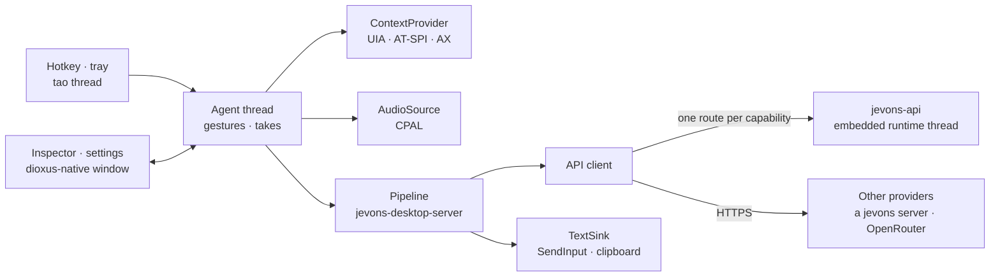

# Desktop app


`jevons-desktop` is a tray app for context-aware dictation and small automations. Press the hotkey in any application and speak. The app reads which application and field you are in, transcribes you, and walks its **flow tree**: a folder of TOML files where each folder is a step. Decisions pick a branch by rules and by the decision model, and the branch it ends in types the text where you were, answers you in a bubble by the tray icon, or calls a tool.

```bash
cargo run --release --locked -p jevons-desktop
```

The first run opens the window when no tray is available; otherwise use the tray icon's menu. Settings live in two files in the platform configuration folder (`%APPDATA%\jevons\config` on Windows, `~/.config/jevons` on Linux): `jevons-desktop.toml` holds the app's (dictation, privacy, automations) and `jevons-server.toml` the server's (providers and routes, models, the flows folder, tools, the API log). See [jevons-desktop.example.toml](../jevons-desktop.example.toml) and [jevons-server.example.toml](../jevons-server.example.toml) for every field.

### The settings folder and its history

On every start, jevons fills in whatever the settings folder lacks: the settings file, the built-in flow tree in `flows/`, and the automations library's guides in `automations/`. Delete the folder and the next start writes the defaults again. The folder is a git repository of its own, created on the first start with everything in it as the first commit.

jevons commits the changes it makes there itself:

- saving the Settings panel, and the tray's **Live feedback** toggle
- approving an automation
- writing an automation from a recording
- saving an extract from the Context tab
- `TOOLS.md`, and the guides and schemas it refreshes

Each commit holds only the files jevons wrote, so your own edits to flows and automations stay uncommitted until you commit them. jevons commits only to a repository it created (marked `jevons.settings = true` in the repository's own `.git/config`). It does not commit its changes to a repository someone else made. The one exception is a reset, which commits the folder before and after so nothing is lost. It also does not make a repository of a folder that is already inside another one, such as a dotfiles repository. Without `git` on the `PATH`, the folder is not versioned and the window says so. The repository has no remote, and it holds whatever the settings file holds, keys included (`api_key`, `remote_key`). Use `TYPESAFE_API_KEY` instead if you push it somewhere.

**Reset settings to the defaults…** in the tray menu asks in the bubble, then writes the defaults: the settings (models, hotkeys, tools, approvals), the built-in flow tree and an empty automations library. It first commits everything in the folder as "The settings before the reset". It then removes everything but `.git`, writes the defaults and commits them, so `git diff HEAD~1` shows what the reset changed and `git checkout HEAD~1 -- flows/ask` brings a branch back. The app then runs with the defaults, with no restart. `jevons-desktop --reset-settings` does the same from a terminal; quit the tray app first. A reset touches only the platform's settings folder, or a folder (given with `--config`) that holds nothing but the settings file, `flows/`, `automations/` and `.git`. A flows folder or library that the settings moved elsewhere is left as it is.

## Using it

- **Push-to-talk:** hold the hotkey (default `Ctrl+Alt+Space`) while speaking. Listening starts on the press, and releasing it sends the take through the flow below. A press too short to hold speech (under 0.4 s) is dropped quietly.
- **Hold or toggle:** each dictation hotkey either listens while held (the default) or starts on a press and stops on the next one. Push-to-talk and the branch hotkeys share one setting (`hotkey_mode`), and live dictation has its own (`live_hotkey_mode`). Both are `hold` or `toggle`, and Settings has a switch under each hotkey.
- **Live dictation:** hold its hotkey (default `F9`) while speaking, or press it to start and again to stop in toggle mode; the tray menu's **Start live dictation** toggles it too. While you speak, the feedback bubble shows the words as they are recognized. Nothing is typed until you stop: then the whole transcript goes through the flow tree, like a push-to-talk take. The app ends a phrase at each pause (0.7 s of quiet at the microphone, or every 20 s of nonstop speech) and keeps all the audio. While push-to-talk runs from a held hotkey, a keyboard hook drops that key's auto-repeats, which Windows would otherwise send to the focused application (a held F10 toggles most applications' menu bar).
- **Live feedback:** a bubble above the tray icon follows each take: the words as they are recognized, then each stage as it runs. A decision's branches light up in turn until it chooses, and then the chosen one stays lit with its probability. An investigation shows what it reads, generation shows the words written, and tool calls and agents show each call. A running stage has moving dots, and a finished one has a check or a cross. At the end the bubble says whether the text was inserted or left on the clipboard. It never takes the focus, lets clicks through, and closes a few seconds after the take ends. Turn it off with the tray menu's **Live feedback** or in Settings.
- **Answers:** a branch whose output is `bubble` (such as the assistant's `ask/`) streams its answer into a larger bubble instead of typing it, even with live feedback off. The answer renders as Markdown (headings, **bold** and *italics*, lists and task lists, quotes, inline code and code blocks, tables), and scrolls with the mouse wheel while it streams and after. It stays until you close it or start another take. Once it is complete the bubble takes clicks: **Copy** puts the answer on the clipboard as plain text and **Copy raw** as the Markdown written, both leaving the bubble open; **Select text** shows the answer's Markdown in a text field, where you can select any part (drag, or Ctrl+A) and copy it with Ctrl+C, and **Done selecting** goes back to the formatted answer; **Insert** types it into the window the take started in (with the usual checks), and **Close** dismisses it.
- **Confirmations:** before a tool runs, the bubble shows the tool and its arguments and waits: **Run** or Enter runs it, **Cancel** or Esc does not. Enter and Esc are taken only while a call waits, and a call nobody answers within a minute is cancelled. The bubble asks even when live feedback is off. Headless runs never run a tool that asks first.
- **Left-click** the tray icon to toggle dictation.
- **Other hotkeys** (set in Settings, by clicking a field and pressing the combination): one to show the inspector, and one per top-level branch of the flow tree to start the take there instead of at the root (such as a hotkey that always asks).
- **Start takes at:** the tray menu can start every take at one top-level branch until you set it back to the root.

The tray icon shows what is happening:

- the jevons alien, glowing cyan when ready, blue while the models load (not ready yet), and grey when no model is loaded;
- amber while GPU kernels are being tuned for the model, which only happens on the first runs and can take minutes (the tooltip and the window say so);
- a waveform that follows your voice while listening;
- green dots while transcribing;
- violet dots while deciding and writing;
- red after a failed take.

The context is read **when the hotkey is pressed**, so the text goes to the field you started in. It is delivered only into that same window, and only once every key is released. If you switched windows, or held keys for more than two seconds, the text stays on the clipboard and the inspector says so.

## How a take works

1. **Context.** The platform accessibility layer reads the focused application, window, field role and name, the selection and the text around the caret. For browsers it also reads the page address. Password fields are never read, text is truncated to `privacy.max_context_chars`, and the clipboard is read only when `privacy.read_clipboard` is on.
2. **Transcription.** Audio streams to `/v1/realtime` as 24 kHz PCM16, and the live text appears in the window. The app commits the turn itself when you finish. When Realtime is off or fails, the recording is uploaded to `/v1/audio/transcriptions` instead.
3. **Machines and the flow tree.** The flows root is a state machine waiting in `idle`, and the take is `said` there (or for the task that waits for it, see [Machines](#machines-tasks-that-wait-for-you)). Its transitions lead to `dictate`, `ask` and `run`, and are chosen like a decision's branches. That state's folder is then walked: at each decision, branches whose guards fail drop out; `select = "rules"` takes the highest priority, and otherwise `/v1/systemone` chooses by the branches' descriptions. When one decision leads straight into another, both are asked in one request, so dictation usually costs a single decision call. Investigations along the way read more of the screen (see below).
4. **Leaf.** A `generate.toml` leaf streams text from `/v1/responses` with the instructions gathered from the root down; a `transcript.toml` leaf uses the words as heard.
5. **Delivery.** Text for the application is pasted (the previous clipboard text is restored afterwards), typed, set through the accessibility API, or copied, as the path's `delivery` says. Answers show in the bubble; clipboard leaves copy.

Every step goes into a trace: the context, each node with the guards it checked, every decision request and its probabilities, the investigations, the exact prompt, the output, the delivery and the timings. The last 50 traces are in the **Takes** tab.

## The flow tree

The flow tree lives in the `flows` folder next to the settings file (`flows_dir` moves it). On the first run jevons writes the built-in tree there, with an `AGENTS.md` that documents the format for people and coding agents, a JSON Schema per node file in `_schemas/`, and a `.taplo.toml` that maps them for editors. When a new version of jevons changes the built-in tree, a folder that still holds an earlier built-in tree, unedited, is brought up to the new one (the **Flows** tab says so); a folder you edited is never touched, and `--init-flows` into an empty folder gives you the new tree to compare. The files reload as soon as you save them. A tree with problems is reported in the **Flows** tab with each file and line, and the last tree that loaded cleanly keeps running. The **Flows** tab draws the tree with each branch indented under the decision that chooses it: a node's kind, what it does (who chooses and the fallback, or where its output goes), its guard and `[prefer]` rules and its priority. Shared branches (`_actions`) say so under each decision that uses them, and the route the Context tab's window takes is marked. Branches fold and unfold, and selecting a node shows its rules in full and its file, with **Open file**.

Each folder is a node, and the file in it names its kind:

| File | Does |
| --- | --- |
| `root.toml` | the flows root's state machine, laid out in `root.fsm` beside it; each subfolder is an agent |
| `agent.toml` | an agent: a state machine in a folder of the root, laid out in `agent.fsm`; each subfolder is a state's work, or a task it starts |
| `task.toml` | a task: a state machine below an agent, laid out in `task.fsm` beside it |
| `decide.toml` | chooses one of its subfolders (or the folders of a shared `_` folder named by `branches`) |
| `generate.toml` | writes text with the language model, for the application, the bubble or the clipboard |
| `transcript.toml` | uses the words as recognized, with no model |
| `tool.toml` | calls a tool registered in the settings |
| `loop.toml` | runs a tool-calling loop over registered tools |
| `run.toml` | runs one of your approved automations, its arguments filled from what you said |

A decision in the built-in tree:

```toml
# flows/dictation/dictate/chat/decide.toml
description = "A chat application"   # what the decision above chooses by
priority = 20                        # dictate/ chooses with select = "rules": highest wins
select = "rules"
fallback = "any"
instructions = "Casual and concise. Keep emoji and names exactly as dictated. No sign-off."

[when]                               # the guard: every rule set must pass, with no model call
app = ["slack.exe", "*teams*", "discord*", "whatsapp*", "telegram*"]
```

Guards can check the application, window title, page address, the focused field's role and name, whether text is selected, whether the field holds text, whether it is editable, the transcript itself (`transcript = "(?i)^translate"`), and one named value, such as what an earlier state of a task wrote (`value = "{searching.body.total}", equals = 0`; also `empty`, `matches` and number comparisons). A guard decides whether a branch can be chosen; `[prefer]`, with the same rules, chooses it with no model call when they pass (a branch whose `[prefer]` fails is still a candidate). Instructions add up from the root down, and each folder may add an `instructions.md`.

The decision model reads each branch's `description` as that choice, along with the application, the window, the focused element and whether it accepts typing, the text around the cursor, the selection and what you said. A model decision takes the branch the model chose when its probability reaches `min_probability`, and otherwise its `fallback`.

The built-in tree:

- The root machine (`root.toml`, `root.fsm`) waits in `idle` and asks which agent the words are for: the application (**dictation**, the `[else]` transition), jevons (**assistant**), or a saved task (**automations**). It takes the model's choice from 70% and dictates below that. Words that start with "Pregunta" or "Question" always go to the assistant, and in a terminal the words are always dictated, both with no model call (`[prefer]` in each agent's `agent.toml`). The agent gets the take, and the root is back in `idle` at once.
- Each built-in agent (`agent.toml`, `agent.fsm`) has one state of work, so it adds no decision: `dictation/dictate/`, `assistant/ask/` and `automations/run/`. An agent is where you add states and tasks.
- `dictation/dictate/` chooses by rules, per application: `code/` and `terminal/` (only insert or type as heard; a terminal's buffer is never rewritten), `chat/` (with `thread/` for replies), `web-mail/`, `notes/` and `any/`. Each takes its branches from the shared `_actions/` folder: `insert`, `replace` (with a selection), `rewrite` (with text in the field) and `verbatim` (the words as heard, no generation).
- `assistant/ask/` answers in the bubble. In Slack it reads, with XPath, the open conversation, its latest messages and the channels (`slack_conversation`, `slack_messages`, `slack_channels`), lazily, and `slack/` answers from them; in other chat apps (`chat/`, `web-chat/`) it first reads the open conversation with an investigation.
- `automations/run/` runs one of your approved automations; the agent is not a choice for the root until one is approved.

### Agents and tasks

An agent is a folder of the root with a machine of its own. It runs for as long as the app, gets every take the root hands it, and routes it among its own states and the tasks it started. A task is a job with an end that takes more than one turn: a search you follow up on ("open the second one"), a draft you revise, a command you confirm. It is a folder below an agent, `task.toml` with `task.fsm`, a state diagram in [Oxidate](https://crates.io/crates/oxidate-fsm)'s Mermaid-like language, and each state's work is the subfolder of its name: a tool call, a generation, a tool loop, a decision tree.

```text
# flows/research/search/task.fsm (examples/desktop/machines/research)
fsm Search {
    timer quiet = 120000 -> quiet
    [*] --> searching
    searching --> answering
    answering --> results
    results --> opening : said [the user wants one of the results opened in the browser]
    results --> reading : said [read]
    results --> searching : said [again]
    results --> [*] : said [the user is done with these results, or talks about something else]
    results --> [*] : quiet
    reading --> results
    opening --> results
    opening --> results : denied
}
```

`searching` is a decision of its own, between the web and the news: words that name the news choose it by rule, and the model reads the two descriptions otherwise. `reading` fetches a result and says what it says ("leeme el segundo").

- **Starting one:** an agent's state whose folder is a task starts it and is done at once, so the task runs beside its agent, which is free for the next take. Several run side by side (`search-1`, `search-2`).
- **Between takes** the task waits in its state. What you say next goes the same way as any take: the root chooses the agent (which is a choice only while it has something to do with the take: a rule that lets it start something, or a task that waits), the agent chooses among its own transitions and its waiting tasks, and the task chosen takes it as its own `said`. One request asks all three. The decision model takes a transition by its guard's sentence (or by the target state's description), with rules first; when it is unsure, a `said` stays where it was, so an unsure take never moves a task on. With `unsure = "parent"` in `task.toml` or `agent.toml` (the example sets both), the machine that stays hands the words to the one above, which takes them as if it were not there: what you dictate while a search waits ends at the root's `[else]` and is typed, in the same single request. Two quiet minutes (`timer`) end this one.
- **When a task ends,** its agent takes `task_done` or `task_failed` and may react (tell you, start another), reading which task as `{task.name}` and what it last wrote as `{task.result}`.
- **Each state does one thing,** and only what its node file says. A machine lists every tool its states call in its node file's `tools`, so a task cannot reach further than that list. Risky work (opening an address, running a command) is a state of its own, reached only by the transitions drawn; its tool asks in the bubble first, and declining it is `denied`, a transition back to where you were.
- **States remember** what earlier states wrote (`{searching}` is the search's result) until the task ends. A result with fields keeps them (`{searching.status}`; a generation with a `[schema]` answers in fields), and a guard can check one, so "the search found nothing" is a rule and costs no model call. A timer's work delivers into the window the task started in, or onto the clipboard when that window is no longer in front.
- **The bubble is the task's conversation.** While the task the latest take reached waits, its bubble stays open and your next words join it: the earlier turns stay above, each with what you said and what the task answered or how the turn ended. **Close** hides it, and **Show the task's conversation** in the tray menu brings it back. It goes when the task ends. Like a chat, the bubble follows its newest text; scroll up and a button takes you back to the end, blinking while more arrives.
- **What decides a transition** is in the open: `jevons-desktop --check-flows` lists, for each machine, whether a state's event is decided by the event alone, by rules, or by the decision model (after the rules, when some apply).
- **One conversation at a time.** A waiting task whose own rule prefers the words takes them before its agent starts another: "Busca …" while a search waits searches again in that search, with no model. The root's model also reads what each agent is in the middle of, so "abrir el segundo" is read as a follow-up. While you speak, the bubble shows that take alone; the search's earlier turns join it once the words turn out to be for the search, and never when they are dictation.
- **When the model is unsure**, a `said` stays where it was, and the Machines tab shows what you said with a button for each transition it could have taken and how sure the model was of each. Click one and the take goes on from there, with no model asked. It can be answered until the machine hears something else. Each answer is added to `~/jevons/machines/examples.jsonl` (what you said, the candidates, the probabilities, the one you chose): examples to tune the transitions' descriptions with.
- **After a restart** a task that waited is still there: jevons keeps the tasks that run in `~/jevons/machines/machines.json` and brings them back when it starts and its models answer. A timer starts over, for its whole time. Work that ran when the app stopped is not run again: its state takes `failed`, so nothing is searched, typed or opened twice. A task whose files you changed meanwhile is ended (the Machines tab says so), since its states may no longer mean what they did. The file holds what you said and what the screen showed, so it is in the data folder, not the settings repository, and **Clear history** removes it.
- **The Machines tab** lists what runs (the root, each agent and its tasks), draws any machine's diagram with the state it is in, each edge coloured by what decides it (the event alone, rules, or the decision model), and shows the transitions taken (by rules, by the model and its probability, or a stay). Each task has its **Cancel**, and **Cancel all tasks** ends them all, as **Cancel the tasks that run** in the tray menu does. A question a take waits on is answered no first, so a cancel never waits for you. The bubble shows where a running task is.

[examples/desktop/machines](../examples/desktop/machines) has the `research` agent with its search task (the web and the news through a search API, and a result read through a page reader), the tools to register and the two lines that add it to the root.

`AGENTS.md` in the folder is the full reference: every field, placeholders such as `{selection}` and `{chat.messages}`, investigations, tools, agents and the rules the loader enforces. [examples/desktop/flows](../examples/desktop/flows) is the built-in tree.

### Extracts: reading the screen with XPath

When the same elements hold what a branch needs every time, such as a chat's channel list or its last messages, an `[extract]` reads them with an XPath expression. It needs no model, and it reads in tens of milliseconds:

```toml
[extract.channels]
xpath = "//TreeItem[.//Group[has-class(@class, 'p-channel_sidebar__channel')]]/@name"
as = "list"

[extract.messages]
xpath = "(//ListItem[starts-with(@automation_id, 'message-list_')][.//Text])[position() > last() - 10]"
as = "table"
fields = { author = ".//Button[1]/@name", text = "string(.//Text[last()])" }
lazy = true
```

- **Vocabulary.** Elements are named by role (`List`, `ListItem`, `TreeItem`, `Edit`…) and attributes are the element's properties (`@name`, `@value`, `@class`, `@automation_id`, `@selected`…). In browsers and Electron apps, `@class` is the page's HTML class list; `has-class()` matches one class. Names follow the user's language, so classes and automation ids make steadier expressions.
- **Answers.** An extract answers as text, a list, a count, a yes/no, or a table with one column per `fields` expression. The answer is available below as `{channels}` and `{messages.author}`, and decisions and generation read it like an investigation's answer.
- **Variables.** `$transcript`, `$app` or `$chat.name` take a placeholder's value inside the expression; a value can never change what the expression means.
- **Applications.** `app = ["slack.exe"]` reads an extract only in takes from those applications; elsewhere its answer is empty. The built-in root declares Slack's extracts this way.
- **Scope.** An expression starts at the take's window. `/Window[@app='slack.exe']//…` with `scope = ["slack.exe"]` reads another application's window, under the same permissions as investigations. A leading `//` searches every window the extract may read, and `.//` only the take's.
- **Search speed.** `//TreeItem[@name = $channel]` runs as one UI Automation search with the role and name as conditions, and fetches the element's properties in the same call.

To write one, use the **Extract workbench** card on the Context tab (below), which reads it in the window in front as a take would, or run `jevons-desktop --xpath "<expression>" --app slack.exe` (or `--tree <file>` for a recorded interface). [automations.md](automations.md) records how Slack's interface looks to UI Automation.

### Investigations: reading more of the screen

The snapshot a take starts with holds the focused field and its text. When a branch needs more, such as the messages of the open conversation, it declares an investigation, and the built-in context investigator reads the application's interface (UI Automation on Windows) to answer it:

```toml
[investigate.conversation]
question = "Which conversation is open in this window, and what are its most recent messages?"
schema = { name = "string", messages = [{ author = "string", time = "string", text = "string" }] }
```

The answer is available to that node and every node below it as `{conversation}` and `{conversation.name}`, and generation prompts include it. The investigator is an agent with five tools:

- `outline`: an element's descendants as compact lines, where wrappers with no text collapse and unnamed rows show the start of their text;
- `find`: search below an element by role or text;
- `xpath`: select elements with an XPath expression, as an extract does;
- `read`: an element's full text;
- `list_windows`: only when other windows are allowed.

Elements get short ids as they are seen, and each tool takes one as an enum of the ids seen so far, so the model picks it with a restricted read and a step never names an element that does not exist. The answer is filled into the schema. When an investigation succeeds, an XPath expression for the element it read is remembered for that application and question (in the platform cache folder, `investigations.json`), and the next time it is read and answered in one call. The take's trace shows the expression, which can become an `[extract]` for that question. The same question twice in a take is answered once.

Investigations read only the window the take started in. To let a question like "is Slack open, and what did Ana say?" read other windows, set `privacy.read_other_windows = true` and list the applications in `privacy.readable_apps`; the investigation's `scope` then names which of them it reads. Password fields are never read, and text is capped at `privacy.max_context_chars` per read.

**Record tree** (in the Context tab's Interface card) saves the interface of the window in front to `~/jevons/trees` as JSON (it holds that window's text: it stays on your machine). `--tree <file>` replays a take against a recorded interface instead of the live one.

### Tools and tool loops

A `tool.toml` node calls one tool; a `loop.toml` node runs a tool-calling loop over several (at most `max_steps` model turns). Tools are registered in the settings, never in the flows folder, so a folder a coding agent edits can call only what you registered. A tool runs on the side whose file it is in: one in `jevons-desktop.toml` runs on your machine, and one in `jevons-server.toml` with the server. Flow files name them the same way either way, and `TOOLS.md` in the flows folder says where each runs.

```toml
# jevons-desktop.toml: these run on your machine
[tools.search]
kind = "open"                          # open | command | http
description = "Searches the web for a query"
url = "https://duckduckgo.com/?q={query}"
arguments = { query = "What to search for" }
confirm = false                        # every tool asks first unless this says otherwise

[mcp.fs]                               # an MCP server over stdio; its tools are fs:<tool>
command = ["npx", "-y", "@modelcontextprotocol/server-filesystem", "C:/Users/me/notes"]
unconfirmed = ["read_file", "list_directory"]
```

```toml
# jevons-server.toml: these run with the server
[tools.lights]
kind = "http"
description = "Turns on the lights of a room"
url = "http://homeassistant.local:8123/api/services/light/turn_on"
body = '{"entity_id": "light.{room}"}'
arguments = { room = "The room, such as kitchen" }
```

- **Built-in tools:**
  - `command` runs a program directly, never through a shell, with each argument as its own element. Only a few basic environment variables and the ones you list reach it, and it has a time limit.
  - `http` sends a request. Arguments are URL-encoded in the address and JSON-escaped in the body, and `${env:NAME}` keeps secrets out of files. `max_output` keeps fewer characters of the answer than the 20,000 every tool keeps, for a page a model is to read.
  - `open` opens an address or file with the default application.
- **MCP servers** start in the background when the app starts and list their tools, which then check the flow files and fill `TOOLS.md` in the flows folder. The model knows an MCP tool as `server__tool`, because tool names cannot hold a colon.
- **Arguments** of a tool node come from `generate` (the language model writes the value), `choose` and `noul` (all of them in one decision read), and `value` (text with placeholders). With `output = "next"`, the node's single branch gets the result as `{result}`.
- **Agents** can always call `investigate`, the context investigator, to read the screen. Their answer streams into the bubble.
- **Confirmation:** every call that asks shows in the bubble first (see [Using it](#using-it)). `allow` on a tool or server limits which flow nodes may use it. The side that runs a tool is the one that enforces both: a tool on your machine asks and checks `allow` there, whatever the server asked for, and automations are always yours. A name registered in both files is an error.
- **Headless runs** (`--replay`, `--transcript`) list the MCP servers' tools but run nothing: each call returns what it would have done, and the trace records it.

### Writing a branch against the real context

The **Context** tab shows what the platform reports for the focused window. It updates twice a second and ignores the inspector's own window. Use **Capture in 3 s**, then switch to the target application.

Below the snapshot, **Read by the flow tree** reads every `[extract]` that applies to the window (those of the nodes its guards reach, lazy ones included, such as the root's Slack extracts when Slack is in front) and shows each answer, with its expression, how many elements it matched and how long it took. It reads again when the window or its title changes (in Slack, when you open another conversation), or on **Read again**.

The **Extract workbench** card is a workbench for them. Pick any `[extract]` of the tree (or **New expression**), edit its expression, its answer type (`as`) and a table's columns (`column = expression`, one per line), and **Try** it: it is checked as the node file would be (a mistake shows with its column) and read in the tab's window as a take reads it, with the same permissions, `app` filter and `$variables` (the tree's other extracts it names are read first). It shows the answer, how many elements matched, what they were and how long it took. With **Live** on, each edit is tried after a pause in typing, and again when the window or its title changes; **Freeze** keeps it on the captured window. **Save to <file>** writes the expression, `as` and columns back into the extract's node file, keeping the file's comments, but only if the tree still loads with the change; the tree then reloads. **Copy as TOML** puts a new expression on the clipboard as an `[extract.<name>]` table, and **Edit** on a reading above opens that extract here.

The **Interface** card browses the window's accessibility tree, to find the element an expression should select. It shows the tab's window (the captured one while **Freeze** is on) and nothing else.

- **Rows.** Each row shows the element's role, name, value (never a password field's), first classes, automation id, and whether it is offscreen or disabled. Its chevron button opens and closes it; its label selects it.
- **Long lists.** A level lists the first 200 children, and a **+** button where the list ends reads the next 200.
- **Opening many levels at once.** **Expand to level** 1 to 5 opens the tree from the window down to that level and closes what is deeper. **Collapse all** closes everything. **Open all below** reads everything under the selected element (or the window) a few levels deep. Each reads at most 1,500 elements.
- **Search.** The search box looks through the whole window, not only what is open, for a text in any element's name, value (never a password field's), class, automation id or role. It reads them as a person does: case, accents and spacing aside, so "andres chort" finds "Andrés Chort". An element that holds every word of the search, in any order or across its properties, matches too, after those that hold the whole text. It reads the window in one search, as `//*` does. Where that fails, it walks the window instead and says how many parts it could not read. It reads at most 5,000 elements and says when it stopped early. It lists the first 100 matches, highlights them in the tree, and shows where the first ten sit. Choosing one opens the tree down to it, selects it and scrolls it into view.
- **Show focused** does the same for the element that had the keyboard focus when the context was captured. Use **Capture in 3 s** with the element focused: the button gives the focus to jevons' own window, so the tab keeps the last other window's focus.
- **Selectors.** Selecting an element lists its properties and the expressions that select it alone, most robust first: by automation id, by class, below a stable ancestor, by the text it shows, by name (in the user's language), and by position. Each is checked against the window as it is now. **Try in workbench** loads one into the **Extract workbench** card as a new expression and tries it; **Copy** copies it.
- **Staleness.** The tree stays on its window. When the tab shows another window, or the window's elements went away (a read fails, or the focused element is gone), the card says so, and **Reload** reads the window anew.

The **Route** card walks the tree for that window by guards and rules alone, and stops at the first decision the model would make. It is drawn like the Flows tab: each decision's branches on a guide line, marked passed or failed, with the chosen one highlighted and the next decision nested under it. A branch's chevron unfolds its rules: each pattern, the value it was compared with, and whether it passed. Each take in the **Takes** tab shows its whole route the same way, with the model's probability for each branch where it was asked. **Flows → New branch from the current context** writes a folder under a decision (such as `dictation/dictate`) whose guard matches that application, page and field (the exact window title is included as a commented-out rule), then opens it for you to add a description and instructions. Choose an agent or a task instead and the folder is a new state of that machine: its diagram gets `idle --> <name> : said` and `<name> --> idle`, from the state the machine waits in.

## Automations

An automation is a task you show jevons once and then run again whenever you like: posting a message to a Slack channel, filing a ticket, filling a form. It is a small script ([Rhai](https://rhai.rs/book/)) that finds elements with XPath and acts on them. It lives in the automations library, the `automations` folder next to the settings file.

### Recording a task

1. Choose **Record an automation…** in the tray menu, or press the record hotkey (Settings → Automations). The tray icon turns magenta.
2. Hold the record hotkey and say what the task is, such as "post a message to a Slack channel". Holding it again later adds a note ("now I pick the channel").
3. Do the task: click, type and press keys. Push-to-talk dictation works as usual, and what it types is part of the recording.
4. Tap the record hotkey, or choose **Stop recording**.

**What is recorded:**
- the element under each click;
- the text typed into each field, as one step, with backspaces applied;
- key chords such as Enter or Ctrl+K;
- switches to another window;
- the window's interface before each step.

**What is not recorded:** the text of password fields, and jevons' own windows.

A recording is a folder in `~/jevons/recordings`, and it holds what your screen showed, so it stays on your machine.

### Writing the automation

When you stop, jevons writes the automation.
1. **The plan.** The language model plans it: a name and description, the arguments (the values that should change from one run to the next, such as the channel and the message), and for each step the XPath expression that finds its element. The expressions come from those jevons recorded, each checked to select exactly that element.
2. **The files.** jevons compiles the plan into `automation.toml` and `script.rhai`, with the recording as a fixture.
3. **The checks.** The result must pass every check before it is offered for approval, including a dry run that replays the recording step by step.

Without a model, the plan comes from the recording alone: the values you also said become the arguments.

A coding agent can write the automation instead. Each recording folder has:
- `AGENTS.md`: the instructions, and where the automation goes;
- `draft/`: the compiled draft;
- `demonstration.json`: the fixture to replay.

The library's own `AGENTS.md` and `API.md` document the format and the script API, and `examples/desktop/automations/slack-post` is an example.

### Approving

Only approved versions run.
- **Asking:** the bubble shows what the automation does: its applications, actions and keys, and how many recorded steps it replays.
- **Answering:** Enter approves it, which pins the hash of its two files in the settings (`[automation.approved]`). Esc keeps it as a draft.
- **Later:** a draft shows as *review and approve…* in the tray's **Automations** menu.
- **Edits:** editing either file makes a new version, which needs approving again.

Nothing in the library folder can approve an automation, so a coding agent that edits it cannot let its own script run.

### Running

- **Tray:** each automation has its own entry in the **Automations** menu.
  - **Run.** When the automation takes arguments, jevons listens: say them ("random, lunch is ready"), then stop dictation from the tray.
  - **Run step by step.** It asks in the bubble before every action, and stops at the first no.
  - **Record it again….** Records the task anew and replaces the automation with the new version, which you approve again. Use it when the application changed and the automation stopped finding its elements.
- **Hotkey:** give it one in Settings → Automations. Hold the hotkey and say the arguments.
- **By voice:** the built-in `run` branch handles requests like "post to random that lunch is ready". The decision model picks the automation, and the language model fills its arguments.
- **From flows:** `tool = "script:slack-post"` in a `tool.toml`, a `run.toml` node, or `tools = ["script:*"]` for an agent.

A run asks in the bubble first unless the automation is listed in `automation.unconfirmed`, and **Cancel the current take** stops it. Its trace goes to `~/jevons/traces`: the steps, every action, and the answer, or the error with its kind, line and column. A failed run also keeps the window's interface in the automation's `failures/` folder, to fix the script against.

`--author <recording>` writes an automation from a saved recording, drafted without a model, and prints its checks. `--replace <name>` makes it a new version of an existing automation. `examples/desktop/recordings/slack-post` is a synthetic recording to try it on.

**Limits.** A script:
- has no file, network or process access;
- reads and acts only in the applications its manifest names;
- sends keys and typed text only to a window of those applications;
- never types into a password field;
- stops at its deadline (`timeout_s`).

## Settings

The **Settings** tab edits the runtime, dictation and privacy settings. A change marks the page (a bar on its left and a dot on the tab) and shows a bar under it, in view however far you scroll: **Apply and save** writes them all at once, and **Revert** drops them. Changes are kept while you visit other tabs.

- **Runtime.**
  - By default the API is private: it listens on an ephemeral loopback port with a random key that only the app knows.
  - *Expose the API* serves it on the address and port you choose, so the OpenAI SDK, Open WebUI or `scripts/smoke-test.py` can use it. It takes the key from `TYPESAFE_API_KEY` or the settings; without a key the API is open.
  - Each request goes to the provider that serves its model (see [Providers and routes](#providers-and-routes)), with that provider's key added, and the answer comes back unchanged. Other clients send the app's key and never hold a provider's. `GET /health` and `GET /v1/models` list what the routes serve.
  - Turning exposure on or off, or changing the port, rebinds the listener without reloading the models.
- **Providers and routes.** Where each capability runs; see [below](#providers-and-routes).
- **Dictation.** The hotkeys (push-to-talk, live dictation, inspector, and one per top-level branch), live feedback, the microphone, language (detected when empty), whether to ask the decision model (when off, decisions take their fallback), and the most tokens a generation may write unless a node sets its own.
- **Privacy.** How many characters of each field to keep, whether to include the clipboard, and the API log. Reading windows other than the take's own has no control in the tab: set `read_other_windows` and `readable_apps` under `[privacy]` in the settings file.

### Providers and routes

The app asks models for four things, and each can come from a different place:

| Capability | What it is | Requests |
| --- | --- | --- |
| Speech | A take's audio to text, uploaded | `/v1/audio/transcriptions` |
| Live speech | The same, streamed while you speak | `/v1/realtime` |
| Decisions | The flow tree's and machines' choices | `/v1/systemone` |
| Generation | Rewrites, answers, loops, the investigator | `/v1/responses`, `/v1/chat/completions` |

By default all four run on the models the app loads (the `embedded` provider). To send one
elsewhere, add a provider and route the capability to it, in the Settings tab or in `jevons-server.toml`:

```toml
[providers.openrouter]
kind = "openrouter"
key = "${env:OPENROUTER_API_KEY}"

[providers.box]
kind = "jevons"
url = "http://box.local:8080"

[routes]
decision = { provider = "openrouter", model = "typesafe/jev-1.13" }
generation = { provider = "box" }
```

- **Kinds.** `jevons` is a jevons server (`http://127.0.0.1:8080`, key from `TYPESAFE_API_KEY`). `openrouter` is OpenRouter (`https://openrouter.ai/api`, key from `OPENROUTER_API_KEY`), which serves Jev through System One and many language models. `openai-compatible` is any other server with OpenAI's API; give its root as `url`, without `/v1`.
- **Keys.** `${env:NAME}` reads the key from the environment, so it stays out of the file, which the app keeps in a git repository.
- **Models.** An embedded or jevons provider names its own model for each capability, so the route needs none. Other providers need `model`.
- **What gets loaded.** Only the models of the capabilities routed to `embedded`. With decisions and generation elsewhere, the app loads the speech model alone.
- **Live speech** follows speech when that is embedded or on a jevons server, and falls back to uploads when the stream cannot open.
- **A provider that fails** (a server that does not answer) is reported in the tray and the Settings tab; the capabilities on the others keep working.

A decision provider that is not jevons gets TypeSafe's System One contract alone. A flow that sets `steps`, `samples` or a thinking budget still runs there, without them, and the take's trace says what was dropped (`steps dropped: openrouter/typesafe/jev-1.13 does not support it`). jevons asks such a provider at most 8 questions a request and splits a longer one, noting it in the trace. OpenRouter documents no limit, so 8 is a cautious guess: set `max_questions` on the provider to change it, and `extensions = ["steps", "samples", "think"]` for one that takes ours.

How sure the decision model must be for a machine to take its choice (`min_probability`) comes from the provider too: 0.7 unless the provider sets it. Probabilities differ between models, so a threshold tuned on one does not carry to another. A machine or node that sets `min_probability` keeps its own.

## Models

The **Models** tab manages the models the app runs.

- **Models folder.** Models live in `~/jevons/models` (`C:\Users\<you>\jevons\models`) unless you choose another folder. Each model goes in its own subfolder.
- **First start.** Nothing downloads by itself. Open the Models tab and press **Download** on DiffusionGemma (about 18 GB with its vision projector) and Parakeet (2.5 GB); once downloaded, they are used for every service without a selected model.
- **Catalog.**
  - When a service has no model selected, the first downloaded entry that serves it is used, in catalog order: DiffusionGemma for generative and decision, Parakeet for speech.
  - Built in: DiffusionGemma 26B-A4B Q4_K_M from [unsloth/diffusiongemma-26B-A4B-it-GGUF](https://huggingface.co/unsloth/diffusiongemma-26B-A4B-it-GGUF), Nemotron-Labs-Diffusion 3B and VLM 8B (generative and decision), and Parakeet TDT 0.6B v3 (speech).
  - The DiffusionGemma repository has no vision projector, so its entry also fetches `mmproj-diffusiongemma-26b-a4b-f16.gguf` from [FreedomAISVR/DiffusionGemma-26B-A4B-it-MXFP4-GGUF](https://huggingface.co/FreedomAISVR/DiffusionGemma-26B-A4B-it-MXFP4-GGUF) into the same folder.
  - **Download** fetches the files from Hugging Face. It resumes interrupted files with an HTTP range and checks each large file against the repository's SHA-256.
  - Nothing downloads unless you press the button. Set `HF_TOKEN` for gated repositories.
- **Selected models.** **Use for …** assigns a downloaded model to a service. **Use existing…** points a service at a model already on disk (a GGUF file or a checkpoint folder) without copying it. Generative and decision on the same model share one engine.
- **Other models.** Add a Hugging Face repository with file globs under *Add a Hugging Face model*, or write the entry into `models.toml` next to the settings file:

  ```toml
  [[models]]
  id = "diffusiongemma-q8"
  name = "DiffusionGemma 26B-A4B Q8_0"
  services = ["generative", "decision"]
  repo = "unsloth/diffusiongemma-26B-A4B-it-GGUF"
  files = ["*Q8_0.gguf"]
  model_file = "diffusiongemma-26B-A4B-it-Q8_0.gguf"
  memory_gb = 30
  ```

- **Existing settings file.** `models.runtime_config` loads an existing `jevons.toml` instead of the selections.

The panel shows the approximate memory of the selected models. On an APU, GPU memory is system memory, so load one large model at a time.

### Logs and traces

The app has no console window on Windows. Everything to review is in the `jevons` folder in your home directory (`C:\Users\<you>\jevons`, `~/jevons`), which **Open logs and traces** in the tray menu opens:

- `logs/jevons-desktop.log`: this run's log, with `jevons-desktop.previous.log` from the run before. Each take logs its steps and timings (transcribed, deciding, generating, delivered) but never your text (the API log below is the one place that holds it, when you turn it on). Set `RUST_LOG` for more detail.
- `traces/<time>-take<n>.json`: the full trace of each take, the same one the Takes tab shows (context, route with the guards checked, decision requests and probabilities, investigations, prompt, output, delivery). The newest 200 are kept.
- `trees/<time>-<app>.json`: the interfaces the inspector's **Record tree** saved.
- `recordings/<time>-<name>/`: recorded demonstrations, for writing automations from (`[automation] recordings_dir` moves them).
- `logs/api.log`, when **API log** is on (Settings → Privacy, or `log_api = true` under `[privacy]` in `jevons-server.toml`): every call to the decision and generation APIs, the investigator's and agents' included. Each record holds the call's exact request body and its response: a decision's whole answer, and for a streamed generation the assembled text plus every event that is not a text delta (such as the final usage). Records are pretty-printed JSON, one after another, so `jq` reads the file as a stream (`jq 'select(.api == "POST /v1/systemone") | .response.answers' logs/api.log`). The log starts over at 32 MB, keeping `api.previous.log`. It holds your words and your screen's text in full, so it is off by default; keys are headers and never written.

**Clear history** in the tray menu clears the logs, the take traces, the recorded interfaces, the recordings or the tasks that run, or **All of it**. It asks in the bubble first; clearing the traces also empties the Takes tab, and clearing the tasks ends them. From a terminal, use `jevons-desktop --clear logs,traces`, or `--clear all` (the kinds are `logs`, `traces`, `trees`, `recordings` and `machines`). Only the files jevons writes there are removed: `.log` files, trace and tree `.json` files, recording folders, and the file the tasks are kept in. Anything else in those folders stays. The open log is emptied, not removed, so a running app goes on writing to it. `models/` is never touched.

The decision and generation have time limits (60 s and 120 s). When the decision model does not answer in time, decisions take their fallback and the words are used as heard; the trace says why. **Cancel the current take** in the tray menu abandons a take without typing anything.

## Headless runs

`--replay` runs one take from an audio file, and `--transcript` from text as if you had said it; both take a context snapshot and print the trace as JSON. They use the same settings (providers, routes and flow tree). Use them for scripted checks and to try a flow tree without speaking:

```bash
cargo run -p jevons-desktop -- --replay examples/speech-en.flac \
  --context examples/desktop/context-slack.json
cargo run -p jevons-desktop -- --transcript "what did Ana say about the launch?" \
  --context examples/desktop/context-slack.json --flow ask
```

`--flow` starts at a branch instead of the root, `--tree` answers extracts and investigations from a recorded interface, and `--deliver` types the result into the focused application.

`--xpath <expression>` prints what an expression selects in the window in front, reading that window only (`--app <glob>` picks another application's window, `--tree <file>` a recorded one). It also reports how long it took and how many elements it read.

For the automations library (the settings' one, or `--library <dir>`):
- `--check-automations [DIR]` checks every automation, dry-running each fixture, and says whether each version is approved.
- `--dry-run <name>` replays a fixture, or `--recording <file>`, and prints the run's trace. `--args <json>` sets the arguments.
- `--run <name> --args <json>` runs an approved automation on the live interface.

`--check-flows [DIR]` checks a flows folder (the settings' one by default), printing every problem with its file and line, and fails when there is one. `--init-flows [DIR]` writes the built-in tree into a folder that has none and refreshes `AGENTS.md`, the schemas and `.taplo.toml`.

`--reset-settings` puts the defaults back in the settings folder, and `--clear <what>` clears history (see [The settings folder and its history](#the-settings-folder-and-its-history) and [Logs and traces](#logs-and-traces)).

### The server alone, and a client of it

The part of the app that decides what to do with a take can run by itself, and a headless take
can run on it from another process:

```bash
jevons-desktop --serve                         # no tray, no window: listens on [server] bind:port
jevons-desktop --server ws://127.0.0.1:8080/desktop --transcript "hello world"
```

`--serve` loads the settings, the models routed to the app and the flows folder, and serves
desktop clients on `ws://<bind>:<port>/desktop`, with the key the exposed API has. With `--server`,
`--replay` and `--transcript` send the take there: the server transcribes, routes and decides, and
asks this side to read the screen and, with `--deliver`, to type. The trace printed is the one
the take would print in one process. A task that waits stays on the server between clients, and across the server's restarts: it keeps its tasks in its own data folder, and brings them back when the first client connects.
The tray app itself still runs its own server in its process.


## Platform status

Every platform layer is a trait in `jevons-desktop-core::platform`, the client. The pipeline, the flow tree and the machines are in `jevons-desktop-server`, which asks the client for delivery, confirmations, screen reads and automations through the `Desk` trait of `jevons-desktop-protocol`; paste safety and tray states are the client's. Each OS implements the layers:

| Layer | Windows | Linux | macOS |
| --- | --- | --- | --- |
| Context | UI Automation: role, name, selection, caret text, browser address | active window only (AT-SPI planned) | active window only (Accessibility API planned) |
| Investigations | UI Automation: windows and their element trees | not yet | not yet |
| Text input | paste, type (SendInput) or set value (UI Automation) | clipboard (Wayland input method, X11 XTest, uinput planned) | clipboard (CGEvent planned) |
| Microphone | CPAL (WASAPI) | CPAL (ALSA/PulseAudio) | CPAL (CoreAudio) |
| Hotkey, tray | global-hotkey, tray-icon | global-hotkey (X11), tray-icon (AppIndicator) | not yet |
| Automation actions | UI Automation patterns, SendInput clicks and keys | not yet | not yet |
| Recording demonstrations | a low-level hook and UI Automation | not yet | not yet |

Platform code uses safe wrapper crates only; the desktop crates forbid `unsafe`.

## Architecture

This is the app as it is. Where it is heading, a desktop server with agents, tasks and an inference router, is the [desktop-server change](../specs/changes/desktop-server/proposal.md) in `specs/`.



- **Main thread:** the dioxus-native (Blitz) window, styled after [Dioxus Components](https://dioxuslabs.com/components/), which hides instead of closing.
- **Tray thread:** a tao event loop that owns the tray icon, menu and global hotkey, and animates the icon.
- **Agent thread:** handles hotkey gestures, reads the context, opens the microphone and starts takes. Takes run on its Tokio workers.
- **Runtime thread:** owns the loaded models (through `jevons_api::load`) and the listener (`jevons_api::serve`), so it can rebind without reloading.
