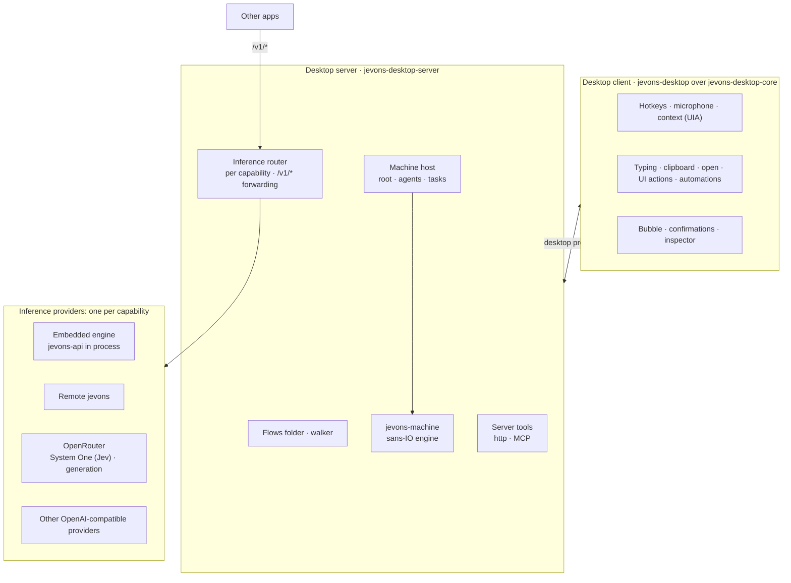
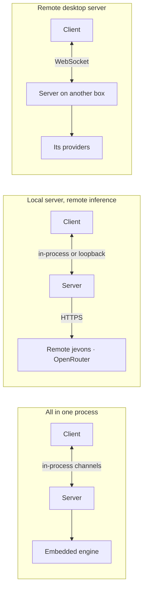

# Desktop server: design

[Proposal](proposal.md) · [Tasks](tasks.md) · [Desktop guide](../../../docs/desktop.md)

This is the target architecture of the desktop app, agreed on 2026-10-02 after the state machine
spike (`spike/desktop-machines`). The decisions:

- **jevons-api is a pure inference API:** the OpenAI-compatible routes and System One, nothing
  desktop-specific. It is one provider among several, and OpenRouter or a similar service can
  replace it.
- **A desktop server hosts everything the desktop needs beyond inference:**
  - the flows folder;
  - the machines: the root, the agents and their tasks;
  - the tools;
  - an inference router that sends each capability to a provider and forwards `/v1/*` for other
    apps.
- **The desktop app is a client of the desktop server.** It captures (hotkeys, microphone, the
  screen's context), acts (typing, the clipboard, opening apps, UI actions), and asks you (the
  bubble, the inspector).
- **Machines run on a sans-IO engine, `jevons-machine`.** Inputs go in and effects come out. It has
  no HTTP, JSON, async, context snapshots or flow folders.
- **Side effects come in three tiers:** engine effects, desktop meaning, and platform mechanics.
  Every safety guarantee lives in the first two and is tested there.
- **The client and the server talk over the desktop protocol.** It is a bidirectional,
  Realtime-like stream of events and effects: a WebSocket between processes, and in-process
  channels when everything runs in one app.
- **An external System One may support less than ours.** Requests to such a provider go without
  the extensions it lacks, and the trace says so. That is accepted.
- **Takes go from the root to an agent, and from the agent to a task.** The root machine only
  dispatches. An agent is a predefined folder with a machine of its own, and it runs tasks:
  instances of task machines, several at once. Dictation is an agent. See
  [Agents and tasks](#agents-and-tasks).
- **Memory beyond a task's own is out of scope for now.** A task keeps what its states wrote until
  it ends; an agent remembers nothing across its tasks yet (see [Deferred](#deferred)).

## Layers



Deployment modes, all from the same crates:



The first mode is today's embedded app: it must cost nothing over calling functions. The second is
the same app with the router pointed elsewhere. The third is supported but is not the main setup.

**Where the desktop server runs** (decided 2026-10-02). The desktop server is light: flows,
machines, tools. It needs to be near the screen, which it reads constantly, not near the GPU,
which the router reaches wherever it is. So:

- **First, inside the desktop app's process** (the first mode), as the spike is. Screen reads are
  function calls, and the context investigator, which reads the screen step by step, costs what
  it costs today.
- **Then, a local background process,** connected over a loopback WebSocket, expected to become the
  main setup: tasks survive restarts and crashes of the app, timers fire with the app closed, and
  other local clients (a CLI, a browser extension) can share the same agents. The protocol is built
  so that this is a deployment change, not a rewrite: the trait boundary first, the WebSocket under
  it next ([tasks](tasks.md), phases 4 and 5).
- **A server on another machine is supported, not optimized for.** A take's screen reads go out as
  one batched effect, and a remote investigator is accepted as slower: each of its steps pays a
  network round trip on top of its model call. Transcripts and screen text then leave the machine.

Reloading the models on every app restart is an inference cost, not the server's: running
`jevons-rs` as its own local process, with the router pointed at it, avoids it in any of these
modes.

## Agents and tasks

```
take ──▶ root machine (dispatches)
            ├─▶ agent "research"     its own machine: modes and routing
            │      ├─ task: search #1    waiting in results
            │      └─ task: search #2    searching
            └─▶ agent "dictation"
                   └─ dictate            done within the take
```

| Term | What it is | Lifetime |
| --- | --- | --- |
| Take | One utterance: the `said` event, with its context. | An instant. |
| Root | The app's machine. It decides which agent a take is for, and nothing else. | The app's. |
| Agent | A predefined folder: its machine (its modes, and how it routes what it gets), its scope (the tools and applications it may use) and the tasks it can start. | The app's: one instance per agent, always running. |
| Task | A unit of work with a goal and an end: an instance of a task machine, started by an agent. | From its start to `[*]`, a failure, a timer or a cancel. |
| State work | What one state does: a generation, a tool call, a decision tree, or a bounded tool loop (`loop.toml`, today's `agent.toml`, renamed so "agent" means only this level). | One state entry. |

An agent persists and coordinates; a task does one job and ends. Both are machines, but an agent's
machine is about routing and modes, and a task's is about the steps of one job.

**How a take moves:**

1. The root waits in `idle`, and the take is `said` there. Its transitions lead to agents, weighed
   as decisions weigh branches: rules first, then the decision model by each agent's
   description, then `[else]`. Entering an agent's state hands it the take, and the root is back
   in `idle` at once: agents run on their own.
2. The agent gets the take as `said`. Its candidates are its own `said` transitions, plus every
   running task of its own that waits for `said`, each described by its current state. The model
   picks among them, after the rules, as anywhere else: it chooses a step, it never invents one.
   Unsure, the agent takes its `[else]`, or keeps waiting and says so.
3. Chosen, a running task gets the take as its own `said`. Chosen, an agent transition may lead
   to a state whose folder is a task machine: entering it starts that task in the background and
   is done at once, so the agent can take the next take while the task runs. A state whose folder
   is plain state work (dictation's decision tree, for example) runs it inline, as today.
4. A task that ends reports to its agent: `task_done` or `task_failed`, with the task's name and
   last result as values. The agent's machine may react (tell the user, start a follow-up task)
   or ignore it.

**One decision call per take.** The root's question, the agent's, and the first decision of the
chosen work go in one System One request, within the provider's question limit, as the spike
already merges the root's question with its states' first decisions. Routing that rules settle,
or that has one candidate, asks nothing. Dictation stays at one call.

**Running instances form a forest:** the root, one instance per agent, and each agent's tasks.
Effects, timers, protocol messages and traces carry the instance they belong to. The Machines tab
shows the agents, each with its running tasks, and draws any of their diagrams.

**Folders.** As everywhere in the flows folder, a folder's node file names its kind, and each
machine level has its own pair: settings (`.toml`) and diagram (`.fsm`, Oxidate's extension). All
three diagrams are the same language; "machine" stays the general word.

| Level | Files | The loader checks |
| --- | --- | --- |
| Root | `root.toml`, `root.fsm` | only at the flows root; never ends; its states are agents |
| Agent | `agent.toml`, `agent.fsm` | only in a root state's folder; never ends; its scope covers its tasks' tools |
| Task | `task.toml`, `task.fsm` | only under an agent; must end; started in the background |
| Tool loop | `loop.toml` (today's `agent.toml`) | bounded state work |

```
flows/
  root.toml, root.fsm            the root: idle --said--> an agent --> idle
  dictation/                     the built-in agents: dictation, assistant, automations
    agent.toml, agent.fsm        its machine, scope and routing
    dictate/decide.toml          state work, run inline
  assistant/ …
  automations/ …
  research/                      an agent you add, with the search example
    agent.toml, agent.fsm
    search/                      a task machine, started in the background
      task.toml, task.fsm
      searching/tool.toml …      its states' work
```

The names make each folder's role visible in a listing, and a misplaced file an error with a
clear message instead of something else silently. A plain node folder in an agent's state runs
inline; a `task.toml` folder starts a task. A task lists its tools, and its agent's scope must
cover them; the root's list covers everything.

**The built-in agents** come from today's root states, each running its work inline, so nothing
changes for dictation: `dictation` (today's `dictate`), `assistant` (today's `ask`, answering in
the bubble) and `automations` (today's `run`). Tasks such as `search` come as examples to add.

## jevons-api: one inference provider

jevons-api keeps its role: `/v1/systemone`, `/v1/responses`, `/v1/chat/completions`,
`/v1/completions`, `/v1/audio/transcriptions` and `/v1/realtime`, served from the local models. It
learns nothing about flows, machines, tools or desktops. In the all-in-one mode the desktop server
loads it in-process (`jevons_api::load` and `serve`, as the runtime thread does now), and it may
still listen on a port for other clients.

OpenRouter also serves System One: Jev (`typesafe/jev-1.13`, alias `~typesafe/jev-latest`, in beta)
answers at `https://openrouter.ai/api/v1/systemone` with TypeSafe's request and response shape,
and TypeSafe's SDKs work against it ([API reference](https://openrouter.ai/docs/api/api-reference/systemone/submit-a-system-one-request),
[Jev on OpenRouter](https://openrouter.ai/docs/guides/community/jev),
[TypeSafe SDK](https://openrouter.ai/docs/guides/community/typesafe-sdk)). So every capability the
desktop uses (decisions, generation, and speech where a provider serves it) can come from outside.

## The desktop server

The desktop server owns what is desktop-specific and not tied to one screen:

- **The flows folder:** loading and checking it, the walker, extracts and investigations as
  requests to the client, and the built-in tree.
- **The machine host:** the instances of the root, the agents and their tasks, the engine's
  effects carried out, timers, and the history the inspector draws.
- **Server tools:** `http` tools, and MCP servers that run on the server's host.
- **The inference router:** one route per capability, and forwarding for other apps.
- **Its settings:** providers and keys, the flows folder, server tools. In the all-in-one mode
  they sit in the same git-versioned settings folder as the client's.

### The inference router

Each capability has a route to a provider and a model:

| Capability | Requests | Providers |
| --- | --- | --- |
| Speech | `/v1/audio/transcriptions`, `/v1/realtime` | embedded, remote jevons, any provider that serves them |
| Decisions | `/v1/systemone` | embedded, remote jevons, OpenRouter (Jev) |
| Generation | `/v1/responses`, `/v1/chat/completions` | embedded, remote jevons, OpenRouter, any OpenAI-compatible provider |

A typical mix runs speech and decisions on the local engine and sends generation to OpenRouter.
Flows and machines never know which provider answered; traces do.

The router also re-exposes `/v1/*` for other apps. The first version is a pass-through: it routes
by model name (a model is served by exactly one route), streams the response back unchanged, and
adds the provider's key, so clients never hold provider keys. `privacy.log_api` covers forwarded
requests like the desktop's own.

### Provider profiles

A decision provider is described by a profile:

- **Extensions:** which of `steps`, `samples`, `think`, `sequential` and images it accepts. These
  come from OpenJEV's extension API ([HTTP API reference](../../../docs/api.md#extensions)), not TypeSafe's
  contract. Our server answers `422` to fields it does not know, and an external provider may too.
- **Limits:** the most questions per request, the label rules, and the size of the state.
- **Calibration:** the `min_probability` that means "sure" for that model.

What a provider lacks is left out, not emulated. A decision node that sets `steps` still runs on
Jev, without `steps`, and its trace says "steps dropped: openrouter/jev does not support it". A
request with more questions than the provider takes is split into several, and the trace notes
the extra calls.

Probabilities are not interchangeable between models. The root's `0.7` was tuned on DiffusionGemma
through our System One, and Jev's calibration is its own. The threshold therefore comes from the
decision model's profile. The built-in tree stops setting it; a node or machine that sets
`min_probability` still overrides the profile.

## jevons-machine: a sans-IO engine

The engine knows what a machine is and how it moves, and does nothing itself:

- **Definition:** states, events, transitions, guards by reference, choice points, timers and
  nesting, checked once. The `.fsm` diagrams (Oxidate's language, read by `oxidate-fsm`) are one front
  end; the engine's model is its own, so the language can change without touching the semantics.
- **Instance:** one machine's state, what it waits for from its host, and the generation that
  tells live timers from stale ones. It is plain data. The host keeps the forest of instances (the
  root, the agents, their tasks) and what each one's states wrote, whose type is the host's; the
  engine moves one instance at a time.
- **Semantics:**
  - which transitions an event makes candidates;
  - the order of rules, then `[prefer]`, then the oracle, then `[else]`, or staying on `said`;
  - choice points, `done` chains and the bound on them, ending and finishing the parent's state,
    and failures nothing handles.

The host drives it:

```rust
enum Input  { Event(Event), Decided(Decision), Finished(Outcome) }
enum Effect {
    // What the host must do.
    Decide(Question), Run { state }, Arm { event, after, generation },
    // What happened.
    Chose(Chosen), Step(Step), Entered { state, generation }, Ended(Outcome), Stopped,
}
fn handle(&mut self, def: &Definition, input: Input, facts: &dyn Facts) -> Vec<Effect>
```

`Definition` is the checked diagram plus what the host knows that it does not say: which states
have work, how a state's work describes itself, the named guards' criteria, and `min_probability`.
The host builds it when it loads the machine's folder.

- **Guards** are evaluated through `Facts`: the engine asks how each candidate fares against its
  rules (its named guard's and its target's), and never learns that `app = …` is about a window.
- **Every decision is reported** (`Chose`), whoever made it, and every transition or stay
  (`Step`), with the words the trace shows. The host adds what only it knows: the rules checked,
  the request sent, the time taken.
- **An event may interrupt a state's work.** A timer or what the user said, arriving while a
  state's work runs (a task in it, for one), is weighed like any other. A transition taken leaves
  the work behind; a machine that stays goes on waiting for it.
- **The decision model is an oracle.** `Decide` lists the candidates with their criteria, and the
  host answers with `Decided` (a choice and its probability), or with no answer. The host may be
  the System One router, a scripted test, or you, clicking a transition in the Machines tab.
- **Candidates are separate from taking a transition.** The engine lists the candidates for an
  event and takes the one chosen, so the host can add an agent's running tasks to its
  candidates and route the take to the task the model chose.
- **Batching is the host's.** Asking the transition question in the same System One request as
  the first decision of each candidate's work keeps dictation at one decision call per take. That
  is an optimization of how effects are carried out, so it lives in the host, not the engine.

### Deterministic transitions

The model is asked only when ambiguity remains, and that is inferred, not declared:

- **The event decides.** `done`, `failed`, `denied` and timer events each select their own
  transitions, and usually there is one (`searching --> answering`): it is taken.
- **One candidate left.** When the rules leave one unguarded transition, it is taken.
- **`[else]`** covers "none of the others apply".

What you declare are rules, checked with no model: a target folder's `[when]` and `[prefer]`, and
named guards (`[guards.<name>]` with `when` and `prefer`). Rules see the context, the transcript,
and the task's own values:

```toml
[guards.no_results]
when = { value = "{searching.results}", empty = true }   # also equals, matches, number comparisons
```

Value checks read the results of earlier states and typed tool and generation results by field,
so "the search found nothing" or "the command exited non-zero" never costs a model call. A general
expression language is left out; if one is ever needed, the repository already embeds Rhai,
sandboxed, for automations.

The loader reports, for each state and event, what decides its transitions: the event alone,
rules, or the model. The Machines tab colours edges the same way, so where the model is involved
is visible.

The engine sits below desktop-core and depends on nothing desktop-specific. It follows the
repository's rule for services: no HTTP or async code, and no request bodies to parse.

## Three tiers of side effects

1. **Engine effects** (`jevons-machine`): decide, run a state's work, arm and cancel timers, entered
   a state, ended. They are abstract and the same everywhere.
2. **Desktop meaning** (`jevons-desktop-server` and `jevons-desktop-core`, platform-free, behind
   traits). On the server:
   - a state's work is a walk of its folder, and the leaf's text is delivered;
   - a machine may call only the tools its `tools` list names;
   - a timer's work delivers to the window the task started in.

   On the client:
   - text goes only into the window the take started in, once no key is held, and otherwise
     onto the clipboard;
   - a tool asks first unless the settings say otherwise.
3. **Mechanics** (`jevons-desktop`, `platform/`): UI Automation, SendInput, the clipboard, the
   bubble, the tray, the agent loop.

Every safety guarantee lives in tier 1 or 2 and is tested there:

| Guarantee | Tier |
| --- | --- |
| An unsure take never moves a task on | 1 |
| A machine calls only what its `tools` lists | 2, server (load-time check) |
| A tool asks before it runs | 2, enforced by the side that runs it |
| Text goes only to the window the take started in | 2, client |

Tier 3 does mechanics only, so a new platform cannot weaken a guarantee by implementing it
differently. Confirmation is enforced by whichever side runs the tool: the server can add a
confirmation but never remove one the client's settings require.

## The desktop protocol

The client and the server exchange events over one bidirectional stream, shaped like the Realtime
API's.

From the client:

- **Takes:** a take starts with its context snapshot and entry, then its audio or its transcript.
- **Effect results:** delivered, declined, failed, the screen's answer, a tool's result.
- **Control:** cancel the task, answer a decision from the inspector, open or close a session (with
  what the client can do: its platform, its sinks, its tools).

From the server:

- **Effects to carry out:**
  - deliver text (`insert`, `replace`, `rewrite`, through `paste`, `type`, `set_value` or the
    clipboard);
  - show an answer in the bubble;
  - confirm a tool call;
  - read the screen (a batch of `[extract]` expressions, or one investigator step);
  - open a URL or an app;
  - run a client tool or an automation.
- **Streams:** the agents and their running tasks, the transitions, the stages, generated text,
  and each finished trace.

Each effect has an id, and its result answers it. Timers, confirmations and screen reads wait on
those ids, never on a socket. In the all-in-one mode the transport is a pair of channels carrying
the same Rust values. Between processes it is a WebSocket carrying JSON, with a key, as the
exposed API has now.

## Where tools run

| Runs on the server | Runs on the client |
| --- | --- |
| `http` tools (web search, APIs) | `open` (addresses and apps) |
| MCP servers on the server's host | `command` (local programs) |
| | UI actions and automations (`script:<name>`) |
| | MCP servers on the client's machine |

Each tool says where it runs. A client tool is an effect the server sends and the client carries
out. Confirmation always happens on the client, because that is where you are. Automations, their
library and their approvals stay with the client: approving a script's exact version is something
you do on the machine it acts on.

## Crates

| Crate | Holds |
| --- | --- |
| `jevons-machine` (new) | The engine: definition, checks, instance, semantics. Also the layout the Machines tab draws, which depends only on the definition. |
| `jevons-desktop-protocol` (new) | Events and effects, their versioned serde shapes, and the in-process and WebSocket transports. |
| `jevons-desktop-server` (new, from desktop-core) | Flows, the walker, the machine host, the investigator, server tools, the inference router and forwarding, provider profiles, the server's settings. |
| `jevons-desktop-core` (what stays) | The platform-free client: platform traits, context snapshots, XPath over accessibility trees, delivery and paste safety, gestures, recording, the automation engine and library, client tools, tray icon frames, the model catalog and downloads. |
| `jevons-desktop` | The client binary: tray, hotkeys, microphone, platform code, the Blitz inspector and bubble. It can host the server in-process. |
| `jevons-api`, `jevons-rs` | Unchanged: the embedded provider and the standalone runtime. |

## Persistence and forwarding

Decided on 2026-10-02:

- **Tasks survive an app restart.** Instances are serializable from the engine's extraction on,
  and persistence is a phase of its own.
  - A restored instance waits in its state again. A state whose work was running when the app
    stopped takes `failed` and is never re-run, so nothing acts twice.
  - An instance whose machine files changed is ended with a note instead of resumed.
  - Instances hold what you said and what the screen showed, so they live in the data folder,
    with **Clear history** covering them, not in the git-versioned settings folder.
- **Forwarding is a pass-through.** The router holds the providers' keys, `privacy.log_api` covers
  forwarded requests, and the route is chosen by model name. Nothing else: no rewriting of
  requests, caching or rate limits until a need shows up.

## Deferred

**Agent memory.** An agent would remember everything it handled, with recall as an explicit,
mostly model-free step:

- an append-only log per agent on the desktop server (takes routed to it, tasks, transitions,
  state results, outcomes), never readable by another agent unless granted;
- structured recall, declared like `[extract]` (`[recall.last_search]`: a machine, a state, how
  many), read before a state runs, with no model;
- full-text recall as a tool for complex tasks, over a pure-Rust index (such as tantivy: no C
  build);
- embeddings later, as a router capability, only if full-text search falls short.

It is out of scope until decided, because it is a new store of your words and screen text: the
repository's rules log neither, with the API log as the only opt-in exception. When it comes, it
needs a per-agent setting (`memory = "all" | "tasks" | "none"`), a modest default for dictation,
and a kind of its own under **Clear history**.

**Rules learned from decisions.** When the traces show the model picking the same transition every
time a rule-visible fact holds (the application is a terminal, say), jevons proposes the
`[prefer]` rule that would decide it, and you accept or reject it, as you approve an automation.
Decisions get cheaper and deterministic over time, never without your consent.
